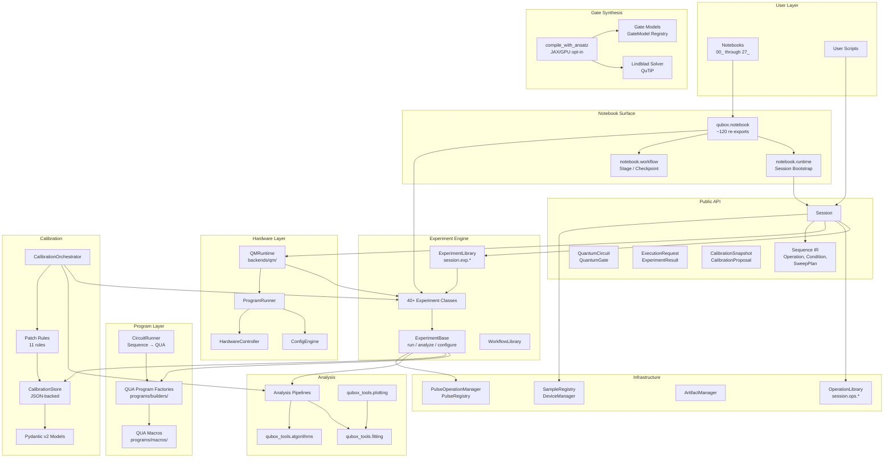
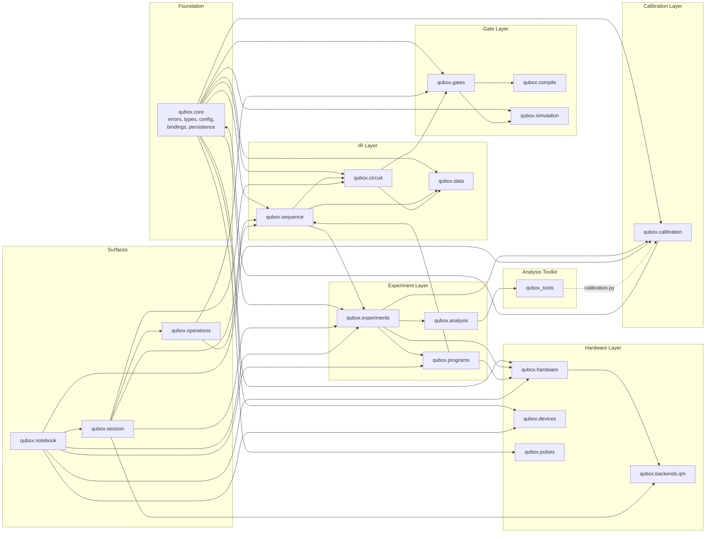
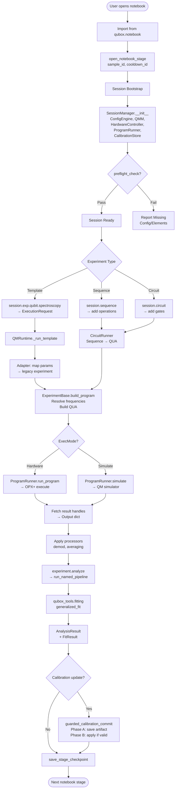
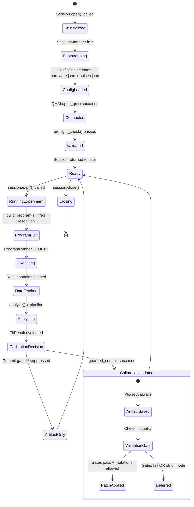
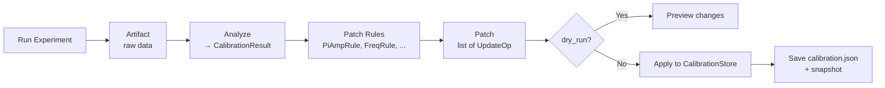

# qubox Architecture & API Audit

**Date:** 2026-03-31  
**Scope:** Full codebase — `qubox/`, `qubox_tools/`, `qubox_lab_mcp/`, `tools/`, `notebooks/`, `tests/`  
**Version:** 3.0.0  
**Method:** Code inspection, not documentation summary. Every claim references actual implementation.

---

## Table of Contents

1. [Repository Structure](#1-repository-structure)
2. [Package & Module Map](#2-package--module-map)
3. [API Design Audit](#3-api-design-audit)
4. [Execution, State & Data Flow](#4-execution-state--data-flow)
5. [Architecture Diagrams](#5-architecture-diagrams)
6. [Design Critique](#6-design-critique)
7. [Target Architecture](#7-target-architecture)
8. [Current State vs Target State](#8-current-state-vs-target-state)
9. [Prioritized Refactor Plan](#9-prioritized-refactor-plan)

---

## 1. Repository Structure

### Top-Level Layout

| Directory/File | Role | Category |
|----------------|------|----------|
| `qubox/` | Main package — public API, experiments, hardware, calibration, session | Core |
| `qubox_tools/` | Post-processing analysis toolkit (fitting, plotting, optimization) | Analysis |
| `qubox_lab_mcp/` | MCP server for code archaeology, notebook inspection, calibration diffing | Tooling / MCP |
| `tools/` | Developer utilities (validation, import analysis, prompt logging) | Dev Tooling |
| `notebooks/` | 28 sequential experiment notebooks (00_ through 27_) | Workflow |
| `tests/` | Pytest test suite (API, schemas, experiments, gate architecture) | Testing |
| `docs/` | CHANGELOG, architecture reviews, design documents | Documentation |
| `past_prompt/` | Append-only AI agent task logs | Audit Trail |
| `samples/` | Sample data / demo configurations | Data |
| `tutorials/` | Tutorial materials | Education |
| `limitations/` | Documented QUA/hardware limitations | Knowledge Base |
| `.github/`, `.skills/` | Agent instruction files, GitHub Copilot/Claude skills | Agent Config |

### Classification by Concern

| Concern | Locations |
|---------|-----------|
| **Public API** | `qubox/__init__.py` (14 symbols), `qubox/notebook/__init__.py` (~120 symbols) |
| **Experiment Orchestration** | `qubox/experiments/` (40+ classes), `qubox/experiments/templates.py`, `qubox/experiments/workflows.py` |
| **Hardware Integration** | `qubox/hardware/`, `qubox/backends/qm/`, `qubox/devices/` |
| **Calibration** | `qubox/calibration/` (store, orchestrator, patch rules, models) |
| **Analysis** | `qubox/analysis/`, `qubox_tools/` (fitting, algorithms, plotting, optimization) |
| **Utilities** | `qubox/tools/` (waveforms, generators), `tools/` (validation scripts) |
| **Persistence / State** | `qubox/calibration/store.py`, `qubox/artifacts.py`, `qubox/session/state.py`, `qubox/core/persistence.py` |
| **Notebook Workflows** | `qubox/notebook/` (runtime, workflow), `notebooks/` |
| **Legacy Code** | `qubox/optimization/` (compat shim), legacy `SessionManager` in `qubox/experiments/session.py` |

---

## 2. Package & Module Map

### 2.1 `qubox/` — Core Package (26 subpackages)

```
qubox/
├── __init__.py              # Public API: 14 exports (Session, Sequence IR, Calibration, Circuit, Data)
├── core/                    # Foundation: errors, types, config, bindings, hardware definition
│   ├── errors.py            # QuboxError hierarchy (8 named exceptions)
│   ├── types.py             # ExecMode, PulseType, WaveformType, type aliases, constants
│   ├── config.py            # Pydantic v2: ControllerConfig, OctaveConfig, ElementConfig, HardwareConfig
│   ├── bindings.py          # ChannelRef, OutputBinding, InputBinding, ReadoutBinding, ExperimentBindings
│   ├── hardware_definition.py  # HardwareDefinition (QM config + Octave)
│   ├── experiment_context.py   # ExperimentContext (sample/cooldown/wiring)
│   ├── persistence.py       # JSON serialization helpers
│   ├── session_state.py     # Runtime state snapshot
│   ├── schemas.py           # Schema versioning
│   ├── protocols.py         # Structural typing (Protocol classes)
│   ├── measurement_config.py   # Measurement directives
│   ├── preflight.py         # Pre-flight validation
│   ├── artifacts.py         # Build-hash artifact storage
│   └── logging.py           # configure_global_logging(), get_logger()
│
├── session/                 # v3 Runtime entry point
│   ├── session.py           # Session class (wraps legacy SessionManager)
│   ├── context.py           # ExperimentContext, compute_wiring_rev()
│   └── state.py             # SessionState (immutable snapshot)
│
├── sequence/                # Hardware-agnostic IR
│   ├── models.py            # Operation, Condition, Sequence
│   ├── sweeps.py            # SweepAxis, SweepFactory, SweepPlan
│   └── acquisition.py       # AcquisitionSpec
│
├── circuit/                 # Gate-level abstraction
│   ├── models.py            # QuantumCircuit, QuantumGate
│   └── (wraps sequence/models)
│
├── data/                    # Execution I/O models
│   └── models.py            # ExecutionRequest (frozen), ExperimentResult (mutable)
│
├── calibration/             # Full calibration lifecycle
│   ├── store_models.py      # 12+ Pydantic models (CQEDParams, PulseCalibration, etc.)
│   ├── models.py            # CalibrationProposal, CalibrationSnapshot
│   ├── contracts.py         # Artifact, CalibrationResult, UpdateOp, Patch
│   ├── store.py             # CalibrationStore (JSON-backed, versioned)
│   ├── orchestrator.py      # CalibrationOrchestrator (run → analyze → patch)
│   ├── patch_rules.py       # 11 patch rules (PiAmpRule, FrequencyRule, etc.)
│   ├── transitions.py       # Pulse name resolution, transition families
│   ├── history.py           # Snapshot listing, loading, diffing
│   ├── algorithms.py        # Fitting/analysis helpers
│   └── mixer_calibration.py # Mixer-specific calibration
│
├── experiments/             # 40+ experiment classes
│   ├── experiment_base.py   # ExperimentBase — run()/analyze()/configure() lifecycle
│   ├── base.py              # ExperimentRunner
│   ├── templates.py         # ExperimentLibrary (session.exp.*)
│   ├── workflows.py         # WorkflowLibrary (session.workflow.*)
│   ├── session.py           # Legacy SessionManager (!!! key legacy coupling)
│   ├── configs.py           # Shared config defaults
│   ├── result.py            # FitResult, RunResult, AnalysisResult, ProgramBuildResult
│   ├── spectroscopy/        # ResonatorSpectroscopy, QubitSpectroscopy, etc.
│   ├── time_domain/         # Rabi, T1, T2Ramsey, T2Echo, Chevrons
│   ├── calibration/         # IQBlob, AllXY, DRAG, ReadoutOptimization, RB
│   ├── cavity/              # Storage spectroscopy, Fock-resolved, chi-Ramsey
│   ├── tomography/          # State tomography, Wigner, SNAP optimization
│   ├── spa/                 # SPA flux/pump optimization
│   └── custom/              # User-defined experiment base
│
├── programs/                # QUA program factories
│   ├── api.py               # Flat re-export of all builders
│   ├── builders/            # Domain-organized QUA builders
│   ├── macros/              # QUA template helpers (sequence, measure)
│   ├── circuit_runner.py    # Sequence → QUA compiler
│   ├── circuit_compiler.py  # Circuit → QUA lowering
│   └── gate_tuning.py       # Gate calibration loops
│
├── hardware/                # Hardware abstraction
│   ├── config_engine.py     # ConfigEngine (load/save/patch QM config)
│   ├── controller.py        # HardwareController (live element control)
│   ├── program_runner.py    # ProgramRunner (execute/simulate QUA)
│   ├── queue_manager.py     # QueueManager (job queue)
│   └── qua_program_manager.py  # QuaProgramManager (legacy compat)
│
├── backends/                # Backend implementations
│   └── qm/
│       ├── runtime.py       # QMRuntime (template → legacy experiment → hardware)
│       └── lowering.py      # Circuit → legacy QUA bridge
│
├── gates/                   # Gate models & hardware implementations
│   ├── gate.py              # Gate (model + optional hardware)
│   ├── model_base.py        # GateModel (registry, unitary, kraus, superop)
│   ├── hardware_base.py     # GateHardware
│   ├── fidelity.py          # Fidelity estimation
│   ├── noise.py             # Decoherence models (T1, T2)
│   ├── sequence.py          # GateSequence
│   ├── models/              # Specific gate models (Rabi, iSWAP, etc.)
│   └── hardware/            # Hardware gate implementations (displacement, SQR, SNAP)
│
├── compile/                 # Gate synthesis & optimization
│   ├── api.py               # compile_with_ansatz()
│   ├── ansatz.py            # Ansatz (parameterized gate sequence)
│   ├── templates.py         # GateTemplate subclasses
│   ├── evaluators.py        # compose_unitary(), fidelity functions
│   ├── objectives.py        # ObjectiveConfig, make_objective()
│   ├── optimizers.py        # OptimizerConfig, run_optimization()
│   ├── param_space.py       # ParamBlock, ParamSpace
│   └── gpu_accelerators.py  # JAX/GPU opt-in acceleration
│
├── pulses/                  # Pulse & waveform management
│   ├── manager.py           # PulseOperationManager
│   ├── pulse_registry.py    # PulseRegistry (clean API)
│   ├── factory.py           # Pulse builders
│   ├── models.py            # Pulse data structures
│   ├── integration_weights.py  # Readout weight generation
│   └── waveforms.py         # Waveform samples
│
├── devices/                 # Sample/cooldown & instrument management
│   ├── registry.py          # SampleRegistry, SampleInfo
│   ├── context_resolver.py  # ContextResolver
│   └── device_manager.py    # DeviceManager, DeviceSpec, DeviceHandle
│
├── analysis/                # Post-processing (delegates to qubox_tools)
│   ├── pipelines.py         # run_named_pipeline() — registry-based
│   ├── fitting.py           # Curve fitting (wraps qubox_tools)
│   ├── output.py            # Result container
│   ├── post_process.py      # Raw data → summary
│   ├── post_selection.py    # Shot filtering
│   ├── metrics.py           # Quality measures
│   └── cQED_plottings.py    # cQED plots
│
├── simulation/              # Numerical cQED simulation
│   ├── cQED.py              # circuitQED() system builder
│   ├── hamiltonian_builder.py  # build_rotated_hamiltonian()
│   ├── solver.py            # solve_lindblad() (wraps QuTiP)
│   └── drive_builder.py     # DriveGenerator, timing validation
│
├── operations/              # Operation library
│   └── library.py           # OperationLibrary (session.ops.*)
│
├── notebook/                # Notebook import surface
│   ├── __init__.py          # ~120 re-exports from all subpackages
│   ├── runtime.py           # Session bootstrap, shared session management
│   └── workflow.py          # Stage management, checkpoints, fit helpers
│
├── tools/                   # Pure waveform utilities
│   ├── waveforms.py         # DRAG, Kaiser, Slepian, flat-top, CLEAR waveforms
│   └── generators.py        # register_qubit_rotation(), ensure_displacement_ops()
│
├── verification/            # Schema & regression testing
│   ├── persistence_verifier.py
│   ├── schema_checks.py
│   └── waveform_regression.py
│
├── optimization/            # Legacy compat shim
├── autotune/                # Minimal autotune workflows
├── gui/                     # Optional interactive tools
├── migration/               # Schema migration docs
├── artifacts.py             # ArtifactManager (build-hash artifact storage)
├── preflight.py             # preflight_check() (session validation)
└── schemas.py               # validate_config_dir(), ValidationResult
```

### 2.2 `qubox_tools/` — Analysis Toolkit

```
qubox_tools/
├── __init__.py              # Top-level exports (Output, fitting routines)
├── data/
│   └── containers.py        # Output(dict) — smart extraction, .npz save/load, merge
├── fitting/
│   ├── routines.py          # generalized_fit() — robust fitting with retry, global opt
│   ├── models.py            # 10+ model functions (Lorentzian, Gaussian, Voigt, exp decay)
│   ├── cqed.py              # cQED-specific models (resonator, qubit spectroscopy)
│   ├── calibration.py       # Fitting → FitResult + CalibrationStore models (COUPLING POINT)
│   └── pulse_train.py       # Bloch vector analysis (pure math)
├── algorithms/
│   ├── core.py              # Peak finding, threshold estimation
│   ├── post_process.py      # Demodulation, readout error correction
│   ├── transforms.py        # IQ projection, post-selection, JSON encoding
│   ├── post_selection.py    # PostSelectionConfig (5 policies + posterior weighting)
│   └── metrics.py           # Wilson CI, Gaussianity scores, MatrixTable
├── optimization/
│   ├── bayesian.py          # GP Bayesian optimization (scikit-optimize)
│   ├── local.py             # scipy.optimize.minimize wrapper
│   └── stochastic.py        # DE, CMA-ES, test functions
└── plotting/
    ├── common.py            # Generic 2D heatmap
    └── cqed.py              # Bloch sphere, IQ scatter, chevrons, tomography
```

### 2.3 `qubox_lab_mcp/` — MCP Server

Read-only MCP server for code archaeology and calibration inspection. 24 tools across 6 categories. STDIO or HTTP transport. Sandboxed via path allowlists and safety policies.

### 2.4 `tools/` — Developer Utilities

| Script | Purpose |
|--------|---------|
| `validate_qua.py` | Compile + simulate QUA programs |
| `validate_standard_experiments_simulation.py` | Trust-gate validation (20 experiments) |
| `validate_notebooks.py` | Execute notebooks to hardware boundary |
| `analyze_imports.py` | AST-based import graph analysis |
| `generate_codebase_graphs.py` | SVG architecture diagrams |
| `pulses_converter.py` | Legacy → declarative pulse spec migration |
| `strip_raw_artifacts.py` | Sanitize calibration JSON |
| `build_context_notebook.py` | Programmatic notebook generation |
| `log_prompt.py` | Agent prompt audit logging |

---

## 3. API Design Audit

### 3.1 Public API (`qubox/__init__.py`)

14 exports organized by domain:

| Domain | Exports |
|--------|---------|
| Session | `Session` |
| Calibration | `CalibrationProposal`, `CalibrationSnapshot` |
| Circuit | `QuantumCircuit`, `QuantumGate` |
| Data | `ExecutionRequest`, `ExperimentResult` |
| Sequence IR | `AcquisitionSpec`, `Condition`, `Operation`, `Sequence`, `SweepAxis`, `SweepPlan` |

**Assessment:** Clean, minimal, well-scoped. Correctly hides implementation details.

### 3.2 Notebook Surface (`qubox.notebook`)

~120 exports spanning all subpackages. This is the primary import path for notebooks.

**Exported categories:** Waveform generators, calibration stack (25+ models), device registry, artifacts, preflight, schemas, hardware definition, session bootstrap, workflow helpers, 30+ experiment classes, hardware/program utilities, verification.

**Assessment:** The notebook surface is necessary for usability but has grown large. It mixes infrastructure (CalibrationStore, ArtifactManager) with user concepts (experiments, checkpoints). See critique §6.

### 3.3 Entry Points & User Workflows

**Primary entry point:**
```python
from qubox import Session
session = Session.open(sample_id="X", cooldown_id="Y", registry_base="E:/qubox")
```

**Template-based experiments:**
```python
result = session.exp.qubit.spectroscopy(qubit="q0", readout="rr0", freq=sweep)
```

**Sequence-based experiments:**
```python
seq = session.sequence()
seq.add(session.ops.x90(target="qubit"))
seq.add(session.ops.measure(target="readout"))
```

**Notebook stage workflow:**
```python
from qubox.notebook import open_notebook_stage, load_stage_checkpoint, save_stage_checkpoint
stage = open_notebook_stage(...)
# ... run experiment ...
save_stage_checkpoint(stage, results)
```

### 3.4 API Classification

| Layer | Type | Examples |
|-------|------|---------|
| **Public / Stable** | Intentional, documented | `Session`, `Sequence`, `Operation`, `SweepPlan`, `ExecutionRequest` |
| **Internal** | Implementation detail, not for users | `ConfigEngine`, `ProgramRunner`, `QMRuntime`, `HardwareController` |
| **Accidental** | Exposed but not designed for user consumption | `ExperimentBase` internals, `SessionManager`, `PulseOperationManager` |
| **Legacy** | Preserved for backward compat, should deprecate | `qubox.optimization/`, `QuaProgramManager`, `Session.__getattr__` forwarding |

### 3.5 Legacy Pathways Still Active

1. **`Session.__getattr__` → legacy `SessionManager`**: Every attribute not on Session falls through to the legacy object. This means users can accidentally access legacy internals.
2. **`qubox.experiments.session.SessionManager`**: The real infrastructure hub. Session is a thin wrapper.
3. **`qubox.backends.qm.runtime._run_template()`**: Instantiates legacy experiment classes via adapters to handle new-style `ExecutionRequest`.
4. **`qubox.notebook` imports from `qubox.experiments.calibration`**: Direct exposure of internal calibration sub-modules.

---

## 4. Execution, State & Data Flow

### 4.1 Typical Execution Flow

```
User Call (session.exp.qubit.spectroscopy)
  │
  ├─ ExperimentLibrary creates ExecutionRequest
  │
  ├─ session.backend.run(request)
  │   └─ QMRuntime._run_template(request)
  │       ├─ Adapter lookup → legacy experiment class
  │       ├─ arg_builder() maps new params → old kwargs
  │       ├─ experiment.build_program(**kwargs)
  │       │   ├─ Resolve calibrated frequencies (CalibrationStore → cQED_attributes)
  │       │   ├─ Apply frequencies to hardware config
  │       │   └─ Build QUA program via programs/ factory
  │       ├─ experiment.run_program(qua_prog) or simulate
  │       │   └─ ProgramRunner → QM SDK → OPX+ hardware
  │       └─ experiment.analyze(result)
  │           └─ run_named_pipeline() → qubox_tools fitting
  │
  └─ Return ExperimentResult
```

### 4.2 State Ownership

| State | Owner | Persistence | Access Pattern |
|-------|-------|-------------|----------------|
| **QM Config** | `ConfigEngine` | `hardware.json` | Read on boot, patched at runtime |
| **Calibration** | `CalibrationStore` | `calibration.json` (versioned) | Read/write, snapshot/rollback |
| **Session Context** | `ExperimentContext` | In-memory (derived from registry) | Computed on init, immutable |
| **QM Connection** | `QuantumMachinesManager` | Transient | Opened on `session.open()` |
| **Pulse Specs** | `PulseOperationManager` | `pulses.json` | Read on boot, mutated at runtime |
| **Experiment Results** | `Output` dict | `.npz` + `.meta.json` | Created per experiment run |
| **Build Artifacts** | `ArtifactManager` | `artifacts/<build_hash>/` | Keyed by config+calibration hash |
| **Session State** | `SessionState` | In-memory snapshot | SHA-256 hash for reproducibility |

### 4.3 Calibration Lifecycle

```
CalibrationStore.load(calibration.json)
  │
  ├─ Experiment reads frequencies via get_calibrated_frequency()
  │   Priority: CalibrationStore → cQED_attributes → fallback → error
  │
  ├─ After experiment: analyze() → FitResult
  │
  ├─ guarded_calibration_commit()
  │   Phase A: Always save timestamped artifact
  │   Phase B: Apply update only if validation gates pass AND allow_inline_mutations=True
  │
  └─ OR via CalibrationOrchestrator:
      run_experiment() → analyze() → build_patch() → apply_patch()
      [Patch = list of UpdateOp, validated by patch rules]
```

### 4.4 Hidden Coupling & Duplicated Responsibilities

1. **Frequency resolution** happens in `ExperimentBase` AND can be overridden by `ConfigEngine`, creating two paths to the same hardware state.
2. **Analysis** is split between `qubox.analysis` (pipeline registry, experiment-specific) and `qubox_tools` (generic fitting, transforms). Some analysis modules in `qubox.analysis` simply delegate to `qubox_tools`.
3. **Pulse management** has two systems: `PulseOperationManager` (legacy, element-op mappings) and `PulseRegistry` (new, clean API). Not unified.
4. **Session** wraps `SessionManager` but forwards all unknown attributes via `__getattr__`, making the boundary between old and new invisible.

---

## 5. Architecture Diagrams

### 5.1 High-Level Architecture



### 5.2 Package Dependency Diagram



### 5.3 User Workflow / Execution Flowchart



### 5.4 State & Session Lifecycle



### 5.5 Calibration Patch Lifecycle



---

## 6. Design Critique

### 6.1 The `SessionManager` God Object

**Location:** `qubox/experiments/session.py`  
**Problem:** `SessionManager` initializes and owns *everything*: `ConfigEngine`, `QuantumMachinesManager`, `HardwareController`, `ProgramRunner`, `QueueManager`, `PulseOperationManager`, `CalibrationStore`, `DeviceManager`, `CalibrationOrchestrator`. It is the central node through which all state flows.

**Impact:**
- Cannot test any subsystem in isolation without mocking the full session
- Cannot use calibration without hardware connection
- Change to any component risks cascading effects
- Session initialization is brittle — strict ordering required, partial init is undefined

**Evidence:** `Session.__getattr__` forwards everything to `SessionManager`, meaning the v3 wrapper cannot fully control its surface area.

### 6.2 Adapter-Mediated Legacy Bridge

**Location:** `qubox/backends/qm/runtime.py`  
**Problem:** The v3 API (`ExecutionRequest`) is translated through adapters into legacy experiment class instantiation. This means:
- Every new experiment needs both a v3 template definition AND a legacy adapter
- Parameter mapping in `arg_builder()` is manual and error-prone
- Silent parameter drops are possible when old and new signatures diverge

**Evidence:** `QMRuntime._run_template()` loads `adapter.experiment_cls` and calls legacy `build_program(**legacy_params)`.

### 6.3 Two Pulse Management Systems

**Location:** `qubox/pulses/manager.py` vs `qubox/pulses/pulse_registry.py`  
**Problem:** `PulseOperationManager` (legacy, used by all current experiments) and `PulseRegistry` (new, clean API) coexist. The new registry is not integrated into the template execution path.

**Impact:** Any pulse-related fix must be applied to the legacy manager; the new registry risks becoming dead code.

### 6.4 Notebook Surface Bloat

**Location:** `qubox/notebook/__init__.py`  
**Problem:** ~120 exports mixing:
- User-facing experiment classes
- Infrastructure (CalibrationStore, ArtifactManager, ConfigEngine)
- Internal data models (CQEDParams, FitRecord, PulseTrainResult)
- One-off helpers (resolve_active_mixer_targets, strip_transition_prefix)

**Impact:**
- No clear boundary between "user needs this" and "implementation detail"
- Import autocomplete is overwhelming
- Adding new experiments automatically expands the surface

### 6.5 Unclear Analysis Ownership

**Location:** `qubox/analysis/` vs `qubox_tools/`  
**Problem:**
- `qubox/analysis/` has modules like `fitting.py`, `post_process.py`, `metrics.py`, `plotting.py`
- `qubox_tools/` has `fitting/`, `algorithms/`, `plotting/`, `optimization/`
- `qubox/analysis/` delegates to `qubox_tools/` for the actual work
- `qubox_tools/fitting/calibration.py` imports from `qubox/calibration/` — creating a circular conceptual dependency

**Impact:** Unclear where to add new analysis logic. Two-package indirection adds complexity without clear benefit.

### 6.6 Frequency Resolution Cascade

**Location:** `qubox/experiments/experiment_base.py` lines 380–420  
**Problem:** Frequency resolution follows a 4-level priority cascade:
1. CalibrationStore
2. cQED_attributes snapshot
3. ExperimentBindings
4. Default / error

The snapshot (level 2) is not automatically updated when CalibrationStore changes. After a calibration commit, the next experiment may use stale snapshot values unless `context_snapshot()` is explicitly called.

**Impact:** Silent frequency errors in multi-experiment notebooks if users forget to refresh context.

### 6.7 Mixed Experiment Result Types

**Location:** `qubox/experiments/result.py`  
**Problem:** Four result types coexist: `FitResult`, `RunResult`, `AnalysisResult`, `ProgramBuildResult`. Experiments return different combinations depending on the execution path.

The v3 API wraps everything in `ExperimentResult`, but legacy experiments return raw `RunResult` or `AnalysisResult`. Notebook code must handle both.

### 6.8 Inconsistent Naming

| Pattern | Example A | Example B |
|---------|-----------|-----------|
| Module naming | `cQED_plottings.py` | `cQED_attributes.py` |
| Class naming | `SampleRegistry` (new) | `DeviceRegistry` (old alias) |
| File naming | `experiment_base.py` | `base.py` (both in experiments/) |
| Pulse naming | `PulseOperationManager` | `PulseRegistry` |
| Calibration model | `FitRecord` (calibration) | `FitResult` (experiments) |

### 6.9 Notebook-Dependent Workflow

**Location:** `qubox/notebook/workflow.py`, `qubox/notebook/runtime.py`  
**Problem:** Core workflow primitives (stage management, checkpoints, shared sessions) live in the notebook subpackage. These are not available to scripts or CI.

**Impact:** Cannot run calibration workflows or sequential experiments outside Jupyter without reimplementing checkpoint logic.

### 6.10 Weak Test Coverage of Critical Paths

**Location:** `tests/`  
**Problem:**
- `test_qubox_public_api.py` uses `DummySession` — doesn't test real Session initialization
- `test_standard_experiments.py` verifies request creation, not program compilation
- No tests for the adapter layer (`arg_builder()` parameter mapping)
- No tests for calibration commit gating, patch rule application, or snapshot versioning
- No integration tests running through the full flow (even with simulator)

---

## 7. Target Architecture

### 7.1 Proposed Module Reorganization

```
qubox/
├── api/                         # Public API (clean, minimal)
│   ├── session.py               # Session (no legacy forwarding)
│   ├── experiment.py            # ExperimentSpec, ExperimentResult
│   ├── sequence.py              # Sequence, Operation, SweepPlan
│   ├── circuit.py               # QuantumCircuit, QuantumGate
│   └── calibration.py           # CalibrationSnapshot, CalibrationProposal
│
├── engine/                      # Experiment execution engine (internal)
│   ├── runner.py                # ExperimentRunner (replaces legacy SessionManager role)
│   ├── compiler.py              # Sequence/Circuit → QUA compilation
│   ├── executor.py              # Hardware submission / simulation
│   └── analyzer.py              # Post-processing dispatcher
│
├── experiments/                  # Experiment definitions (unchanged structure)
│   ├── spectroscopy/
│   ├── time_domain/
│   ├── calibration/
│   ├── cavity/
│   ├── tomography/
│   └── spa/
│
├── hardware/                    # Hardware abstraction (consolidated)
│   ├── config.py                # ConfigEngine (unchanged)
│   ├── controller.py            # HardwareController (unchanged)
│   ├── executor.py              # ProgramRunner (renamed for clarity)
│   └── pulses.py                # Unified pulse management
│
├── calibration/                 # Calibration lifecycle (unchanged)
│   ├── store.py
│   ├── orchestrator.py
│   ├── patch_rules.py
│   └── models/                  # Pydantic models in subdirectory
│
├── analysis/                    # REMOVE — merge into qubox_tools
│
├── gates/                       # Gate synthesis (unchanged)
├── compile/                     # Gate compilation (unchanged)
├── simulation/                  # Numerical simulation (unchanged)
│
├── core/                        # Foundation (unchanged)
├── data/                        # I/O models (unchanged)
├── devices/                     # Registry (unchanged)
│
├── notebook/                    # Notebook surface (slimmed)
│   ├── __init__.py              # Only user-facing symbols
│   ├── runtime.py               # Session bootstrap only
│   └── workflow.py              # Stage/checkpoint (generalized to work outside notebooks)
│
└── _compat/                     # Temporary backward compat (explicit deprecation)
    ├── session_manager.py       # Old SessionManager with deprecation warnings
    └── pulse_operation_manager.py
```

### 7.2 Key Structural Changes

1. **Eliminate `Session.__getattr__` forwarding.** Session should own its public API explicitly. Legacy access should require explicit `session._legacy` (with deprecation warning).

2. **Unify pulse management.** Merge `PulseOperationManager` capabilities into `PulseRegistry`. Provide a compat shim during transition.

3. **Remove `qubox.analysis/`.** All analysis logic should live in `qubox_tools/`. Experiment-specific analysis pipelines become thin adapters that call `qubox_tools` directly.

4. **Generalize workflow primitives.** Move checkpoint/stage logic out of `qubox.notebook` into a general `qubox.workflow` package usable from scripts and CI.

5. **Slim notebook surface.** Only export symbols users type in notebooks. Infrastructure classes accessed via explicit imports.

6. **Remove adapter-mediated legacy bridge.** Once experiments are migrated to build programs directly from `ExecutionRequest` parameters, the adapter layer becomes unnecessary.

### 7.3 Improved State Model

```
Session.open()
  │
  ├─ ConfigStore (immutable after load)
  │     hardware.json + pulses.json → validated config
  │
  ├─ CalibrationState (copy-on-write)
  │     calibration.json → versioned snapshots
  │     Explicit refresh API: session.calibration.refresh()
  │
  ├─ HardwareConnection (transient, explicit lifecycle)
  │     connect() / disconnect() / is_connected
  │     No lazy init — explicit connection required
  │
  └─ WorkflowState (session-scoped)
        Current stage, checkpoint path, artifact path
        Available outside notebooks
```

### 7.4 Module Boundary Rules

| Module | May Import From | Must Not Import From |
|--------|----------------|---------------------|
| `qubox.core` | stdlib, numpy | anything in qubox |
| `qubox.sequence` | core | experiments, hardware |
| `qubox.circuit` | core, sequence | experiments, hardware |
| `qubox.calibration` | core | experiments, hardware |
| `qubox.experiments` | core, sequence, calibration, programs | notebook, backends |
| `qubox.hardware` | core | experiments, calibration |
| `qubox.backends` | core, hardware, experiments | notebook |
| `qubox.notebook` | anything | (leaf node) |
| `qubox_tools` | core (minimal), numpy, scipy | experiments, hardware, session |

---

## 8. Current State vs Target State

| Dimension | Current | Target |
|-----------|---------|--------|
| **Entry point** | `Session` wraps `SessionManager` via `__getattr__` | `Session` owns full API; legacy shimmed in `_compat/` |
| **Experiment execution** | v3 request → adapter → legacy class → hardware | v3 request → engine/runner → hardware (no adapter) |
| **Pulse management** | Two systems (POM + PulseRegistry) | Unified PulseRegistry |
| **Analysis** | Split across qubox.analysis + qubox_tools | Consolidated in qubox_tools |
| **Frequency resolution** | 4-level cascade with stale snapshots | CalibrationState with explicit refresh, no silent fallback |
| **Notebook surface** | ~120 mixed exports | ~40 user-facing exports; infrastructure via explicit import |
| **Workflow primitives** | Notebook-only (qubox.notebook.workflow) | General-purpose (qubox.workflow), usable from CLI/CI |
| **Test coverage** | API shape tests with mocks | Full-flow tests with simulator; adapter mapping tests |
| **Naming** | Mixed conventions (cQED_plottings, DeviceRegistry) | Consistent snake_case, no legacy aliases in public API |
| **Backend abstraction** | QM-only with hardcoded assumptions | Backend protocol with QM as primary implementation |

---

## 9. Prioritized Refactor Plan

### Immediate (next 1–2 tasks)

| # | Action | Impact | Risk |
|---|--------|--------|------|
| 1 | **Add adapter mapping tests.** Write tests that verify `arg_builder()` parameter mapping for all 21 templates. | Prevents silent parameter drops | Low |
| 2 | **Add calibration commit tests.** Test `guarded_calibration_commit()` with pass/fail/strict-mode scenarios. | Validates critical safety path | Low |
| 3 | **Document `Session.__getattr__` behavior.** Add deprecation warning when forward-to-legacy is used. | Makes legacy usage visible | Low |
| 4 | **Consolidate FitResult/FitRecord naming.** Choose one name, alias the other with deprecation. | Reduces confusion | Low |

### Medium-term (next 3–6 tasks)

| # | Action | Impact | Risk |
|---|--------|--------|------|
| 5 | **Unify pulse management.** Migrate PulseOperationManager features into PulseRegistry. Keep POM as compat shim. | Eliminates dual system | Medium |
| 6 | **Merge qubox.analysis into qubox_tools.** Move pipeline registry to qubox_tools; experiment-specific adapters remain in qubox.experiments. | Clears ownership confusion | Medium |
| 7 | **Slim notebook surface.** Split `qubox.notebook` exports into tiers: `qubox.notebook` (essentials), `qubox.notebook.advanced` (infrastructure). | Cleaner UX | Medium |
| 8 | **Generalize workflow.** Extract stage/checkpoint logic from `qubox.notebook.workflow` into `qubox.workflow`. Notebook module becomes thin wrapper. | Enables CI/script workflows | Medium |
| 9 | **Add simulator integration tests.** Test full flow (request → build → simulate → analyze) for at least 5 core experiments. | Catches regressions | Medium |

### Long-term (architectural)

| # | Action | Impact | Risk |
|---|--------|--------|------|
| 10 | **Eliminate adapter layer.** Migrate experiments to accept `ExecutionRequest` directly. Remove `arg_builder()` adapters. | Simplifies execution path | High |
| 11 | **Replace `SessionManager` with engine.** Build `qubox.engine.ExperimentRunner` that composes hardware, calibration, and execution without god-object pattern. | Core architecture improvement | High |
| 12 | **Remove `Session.__getattr__` forwarding.** All legacy access via explicit `session._compat` with deprecation timeline. | Clean API surface | High |
| 13 | **Implement CalibrationState with copy-on-write.** Replace snapshot staleness problem with explicit refresh + versioned reads. | Prevents silent frequency errors | Medium |
| 14 | **Backend protocol formalization.** Define `Backend` Protocol; make QM an implementation. Enable dry-run backend for testing. | Testability, extensibility | Medium |

### Migration Path

```
Phase 1 (Safety): Items 1–4
  └─ No behavioral changes, purely defensive

Phase 2 (Consolidation): Items 5–9
  └─ Backward-compatible changes with compat shims
  └─ Each item is independently shippable

Phase 3 (Architecture): Items 10–14
  └─ Breaking changes with documented migration
  └─ Requires version bump (3.1.0 or 4.0.0)
  └─ Each item requires notebook updates + user communication
```

---

## Appendix A: File Count by Package

| Package | Python Files | Lines (est.) |
|---------|-------------|------|
| qubox/core | 17 | ~2,500 |
| qubox/experiments | 45+ | ~8,000 |
| qubox/programs | 20+ | ~4,000 |
| qubox/calibration | 12 | ~3,000 |
| qubox/hardware | 5 | ~1,500 |
| qubox/gates | 15+ | ~3,000 |
| qubox/compile | 11 | ~2,500 |
| qubox/session | 4 | ~800 |
| qubox/sequence | 4 | ~600 |
| qubox/simulation | 4 | ~1,200 |
| qubox/pulses | 7 | ~1,500 |
| qubox/devices | 4 | ~800 |
| qubox/analysis | 12 | ~2,000 |
| qubox/notebook | 3 | ~500 |
| qubox_tools | 12 | ~4,500 |
| qubox_lab_mcp | 20+ | ~3,000 |
| **Total** | **~200** | **~39,000** |

## Appendix B: Key Design Decisions Worth Preserving

1. **Channel Binding API** (`qubox.core.bindings`): Physical ports as stable identity, bindings as logical layer. Survives hardware rewiring. Keep.
2. **Patch transactionality** (`qubox.calibration`): All-or-nothing calibration updates gated by FitResult.success. Keep.
3. **Semantic IR** (`qubox.sequence`): Hardware-agnostic operation representation. Essential for testability. Keep.
4. **Factory pattern** (`qubox.programs`): QUA builders separated from experiment orchestration. Keep.
5. **Two-phase calibration commit**: Always persist artifact, conditionally apply. Correct safety model. Keep.
6. **Lazy backend resolution**: Session can exist without hardware. Keep.
7. **Registry-based discovery**: ExperimentLibrary, OperationLibrary, pipeline registry. Scales well. Keep.
