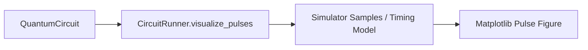
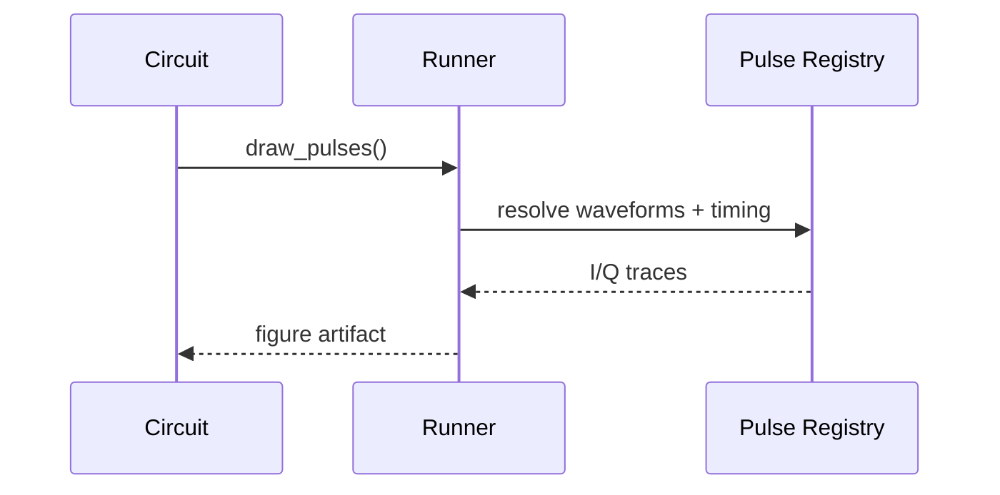

# Circuit Pulse Visualization Validation

Validation mode: compiled timing-model pulse visualization generated from compiled gate sequence and pulse registry (no hardware execution).

## Architecture diagram



## Data flow diagram



## Example pseudo-code

```python
fig_logical = circuit.draw_logical(save_path='logical.png')
fig_pulse = circuit.draw_pulses(runner, save_path='pulses.png')
```

## Integration boundaries

- Inputs: compiled circuit order, pulse operations, tuning records
- Outputs: deterministic pulse plots per element/channel
- Excluded: live hardware oscilloscope capture

## Scope

- Legacy vs tuned `X180`
- Legacy vs tuned derived `X90`
- Tuned short circuit `X180 -> X90`

## Expected tuning effect

- Expected tuned scale `X180`: 0.92
- Expected tuned scale `X90` (derived): 0.46
- Legacy reference peak |I| `X180`: 0.0926256
- Legacy reference peak |I| `X90`: 0.0463128
- Expected tuned peak |I| `X180`: 0.0852156
- Expected tuned peak |I| `X90`: 0.0213039

## Figures

- [X180 legacy](docs/figures/circuit_pulses/x180_legacy.png)
- [X180 tuned](docs/figures/circuit_pulses/x180_tuned.png)
- [X90 legacy](docs/figures/circuit_pulses/x90_legacy.png)
- [X90 tuned](docs/figures/circuit_pulses/x90_tuned.png)
- [X180 -> X90 tuned circuit](docs/figures/circuit_pulses/xy_pair_tuned.png)

## Verdict

PASS — visualization APIs produce deterministic logical and pulse-level outputs for tuned/derived gates in simulator-only mode.
