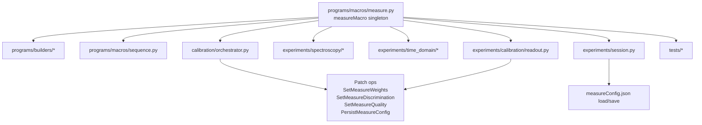
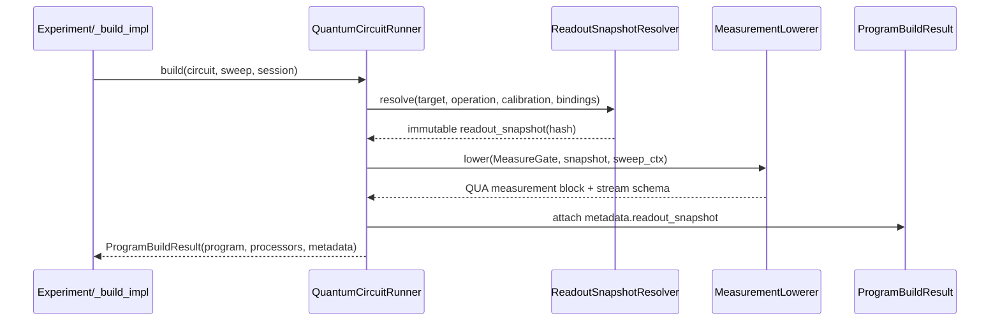

# RFC: Removal of measureMacro Singleton and Introduction of a First-Class Measurement Gate

## Status
Design-only proposal (no code changes).

## Motivation

The current architecture uses a mutable singleton (`measureMacro`) to configure and emit measurement behavior inside QUA builders. This creates system-level risks:

1. Hidden global state
2. Non-deterministic program builds
3. Implicit readout policy coupling
4. Cross-experiment leakage (GE → Butterfly)
5. Friction with circuit abstraction
6. Weak provenance reproducibility

As the project evolves toward circuit-level composition, measurement must become explicit, immutable, calibration-aware, and compile-time resolved.

## Architectural Goals

The redesign must:

- Eliminate mutable global measurement state
- Keep build outputs deterministic
- Preserve `ProgramBuildResult` contract
- Preserve `CalibrationOrchestrator` lifecycle and patch semantics
- Preserve strict-mode validation behavior
- Preserve analysis output contracts (keys, shapes, metric conventions)

## Core Proposal

### Deprecate and remove global measureMacro

All measurement configuration becomes explicit in build context and circuit intent. Runtime mutation of singleton state is replaced by immutable measurement specifications attached to each compiled program.

### Measurement as a first-class gate

```python
@dataclass(frozen=True)
class MeasureSpec:
    kind: str  # "iq" | "discriminate" | "butterfly" | "adc"
    acquire: tuple[str, ...] = ("I", "Q")
    policy: str | None = None
    policy_kwargs: dict[str, Any] = field(default_factory=dict)
    calibration_snapshot: dict[str, Any] | None = None
    metadata: dict[str, Any] = field(default_factory=dict)

@dataclass(frozen=True)
class MeasureGate:
    target: str | tuple[str, ...]
    spec: MeasureSpec
```

This replaces implicit singleton calls like `measureMacro.measure(...)` with explicit gate-level intent.

## Calibration Snapshot Model

At compile time, resolve and attach a readout snapshot with all parameters required to lower measurement deterministically:

- IQ rotation parameters
- Discrimination model parameters
- Threshold / posterior / LLR knobs
- Integration-weight identifiers + shape metadata
- Default state-prep/post-selection policy
- Hash/version token for provenance

Example:

```python
readout_snapshot = {
    "rotation_angle": ...,
    "threshold": ...,
    "sigma_g": ...,
    "sigma_e": ...,
    "weights": {"cos": "...", "sin": "...", "minus_sin": "..."},
    "policy": {"name": "THRESHOLD", "kwargs": {...}},
    "integration_length": ...,
    "version_hash": "...",
}
```

Attach this to:

- `MeasureSpec.calibration_snapshot`
- `ProgramBuildResult.metadata["readout_snapshot"]`

Result: deterministic builds and reproducible provenance.

## Current Dependency Graph (measureMacro usage)

The current repository shows `measureMacro` coupling across multiple layers.

### High-level graph



### Observed coupling hotspots

- Builder imports from measurement singleton in core program families:
  - `programs/builders/time_domain.py`
  - `programs/builders/spectroscopy.py`
  - `programs/builders/readout.py`
  - `programs/builders/calibration.py`
  - `programs/builders/cavity.py`
  - `programs/builders/tomography.py`
  - `programs/builders/utility.py`
  - `programs/builders/simulation.py`
- Runtime/session lifecycle interaction:
  - `experiments/session.py` loads/saves macro state and syncs from calibration.
- Orchestrator patch execution updates singleton state directly:
  - `calibration/orchestrator.py` (`SetMeasure*`, `PersistMeasureConfig`, sync)
- Readout workflows (GE/BF) rely on mutable singleton transitions:
  - `experiments/calibration/readout.py`

## Measurement Lowering Strategy

Compile-time lowering for each `MeasureGate`:

1. Resolve logical target alias → hardware/binding endpoint
2. Resolve snapshot (or fail in strict mode)
3. Inject integration weight mapping into lowering context
4. Apply optional rotation/discrimination transform
5. Emit QUA measurement sequence
6. For butterfly, emit retry loop + recovery pulses + max-trials guard
7. Register stream handles/processors in deterministic order
8. Persist measurement provenance in `ProgramBuildResult`

### Sequence diagram



## Supported Measurement Modes

### IQ acquisition (`kind="iq"`)

- Outputs: `I`, `Q` (optionally `S`)
- No discrimination

### GE discrimination (`kind="discriminate"`)

- Applies selected discrimination model
- Outputs: state label and requested IQ channels
- May emit patch intents through analysis metadata

### Butterfly (`kind="butterfly"`)

- Encodes multi-measure retry logic explicitly
- Supports `r180` recovery pulses and `max_trials`
- Uses explicit acceptance policy carried by `MeasureSpec`

### ADC/raw (`kind="adc"`)

- Produces raw-trace style outputs
- Keeps existing trace key conventions

## Policy Handling

Policy is no longer global.

- GE analysis emits recommended policy + kwargs
- Butterfly consumes policy explicitly from its own `MeasureSpec`
- No implicit singleton propagation between experiments

## Strict Mode Implications

In strict context mode:

- Missing calibration snapshot → hard error
- Pending patch dependency for required snapshot fields → hard error
- Snapshot hash mismatch vs expected context → warning or error (policy-driven)

## Integration with Existing Runtime

This proposal is compatible with current lifecycle boundaries:

- `ExperimentBase` contract remains `build/run/analyze/plot`
- `ProgramRunner` remains execution backend
- `CalibrationOrchestrator` remains patch owner
- `ProgramBuildResult` remains canonical provenance container

Required extension:

- add measurement snapshot payload under `ProgramBuildResult.metadata`
- add deterministic lowering context to builder/circuit compile path

## Migration Plan

### Stage 0 — Snapshot infrastructure

- Introduce snapshot resolver and hash policy
- No behavior change yet

### Stage 1 — Wrapper compatibility layer

- Introduce `MeasureSpec` / `MeasureGate`
- Internally bridge to existing macro while collecting parity data

### Stage 2 — Builder refactor

- Replace singleton calls in builders with first-class measurement lowering
- Keep output contracts and processors unchanged

### Stage 3 — Session/orchestrator transition

- Move `SetMeasure*` operations to snapshot-oriented updates
- Stop direct singleton mutations in orchestrator/session path

### Stage 4 — Singleton removal

- Remove `measureMacro` singleton and `measureConfig` dependency path
- Enforce snapshot-only measurement compilation

## Compatibility Requirements (Must Hold)

- Stream buffer shapes
- Output key names and value semantics
- Sweep axis behavior/order
- Patch metadata schema expected by orchestrator rules
- Existing analysis contracts and calibration quality gates

## Parity Test Checklist

### Build parity

- [ ] Same handle names (`I`, `Q`, `iteration`, etc.)
- [ ] Same buffer dimensions and axis order
- [ ] Same measurement loop nesting behavior

### Run parity

- [ ] Equivalent result distributions within statistical tolerance
- [ ] No unexpected queue/progress behavior differences

### Analysis parity

- [ ] Same fit convergence behavior and metric names
- [ ] Same patch intent payload shape and operation names

### Strict-mode parity

- [ ] Same failure conditions for missing calibration context
- [ ] Explicit GE→Butterfly policy wiring validated

### Provenance parity

- [ ] `ProgramBuildResult` remains serializable
- [ ] Snapshot hash stored and reproducible

## Risk Assessment

1. Hidden dependencies on side effects in current builders
2. Implicit reliance on mutable readout state between experiments
3. Butterfly retry/liveness logic drift during refactor
4. Processor ordering drift causing subtle downstream breakage
5. Mixed-mode period complexity (wrapper + new lowering coexistence)

Risk controls:

- Start with pilot migration (PowerRabi, T1) before readout-heavy paths
- Freeze parity harness for output keys/shapes
- Gate butterfly migration on explicit policy contract tests
- Enforce snapshot hash checks in CI design-validation tests

## Removal Timeline Recommendation

- Milestone M1 (1-2 sprints): Stage 0 + Stage 1
- Milestone M2 (2-3 sprints): Stage 2 for time-domain and selected spectroscopy
- Milestone M3 (1-2 sprints): Stage 2 for readout/GE/Butterfly + Stage 3 transition
- Milestone M4 (1 sprint): Stage 4 singleton removal and cleanup

Go/no-go gates before Stage 4:

- 100% parity pass on required checklist for migrated experiments
- No strict-mode regressions in calibration workflows
- Orchestrator patch semantics unchanged from consumer perspective

## Required Deliverables from Design Review

1. Validated dependency graph of existing `measureMacro` usage
2. Approved `MeasureSpec` / `MeasureGate` schema
3. Accepted lowering sequence and strict-mode policy
4. Signed parity checklist and acceptance thresholds
5. Migration risk register with owner per risk
6. Final singleton-removal timeline with milestones

## Success Criteria

After migration:

- No global measurement state dependency
- Deterministic program builds from explicit inputs
- Explicit GE→Butterfly wiring
- Simpler strict-mode enforcement through snapshot validation
- Safe foundation for Gate/Circuit abstraction roll-out

## Executive Summary

Removing the measurement singleton is a foundational architectural step for `qubox_v2`. Measurement must be explicit, immutable, calibration-snapshotted, compile-time resolved, and fully represented in provenance. This RFC provides a staged, parity-first path to do so without breaking current experiment and orchestrator contracts.
