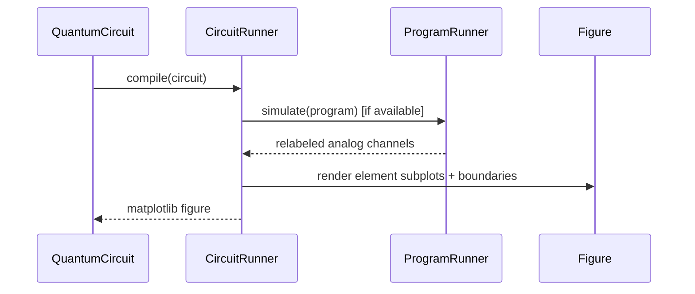

# Design: Circuit Visualization System

## Status
Implemented (MVP Phase 1) for logical diagrams + compiled pulse visualization.

## Objectives
Every `QuantumCircuit` must be drawable in two representations:
1. Logical circuit diagram (`QuantumCircuit.draw_logical()`)
2. Pulse-level diagram (`QuantumCircuit.draw_pulses()` / `CircuitRunner.visualize_pulses()`)

Both are deterministic and intended for verification/debug/documentation.

## Gate Identity and Naming
Each gate receives stable identity:
- Optional user name: `instance_name`
- Default deterministic name:

`<GateFamily>_<AngleOrParam>_<Target>_<Index>`

Examples:
- `X_pi_q1_0`
- `X_pi2_q1_1`
- `Disp_alpha0.5_cavity_0`

## Architecture

```mermaid
flowchart TD
  A[QuantumCircuit] --> B[with_stable_gate_names]
  B --> C[draw_logical]
  B --> D[CircuitRunner.compile]
  D --> E[visualize_pulses]
  E --> F[Simulator samples (preferred)]
  E --> G[Compiled timing-model fallback]
```

## Logical Diagram
### API
`QuantumCircuit.draw_logical(include_instance_name=True, save_path=...)`

### Rendering Rules
- Wires are deterministic (sorted targets)
- Gate boxes rendered in time order
- Labels include family + parameter + optional instance name
- Exportable to PNG/PDF via matplotlib save path

## Pulse-Level Diagram
### API
`CircuitRunner.visualize_pulses(circuit, sweep=..., zoom_ns=..., save_path=...)`

### Source of Truth
- Preferred: compiled program simulation samples
- Fallback: compiled timing model + pulse registry waveforms

### Features
- Multi-channel overlay
- Grouping per element (subplot per element)
- Gate-boundary annotations from stable gate names
- Optional zoom window

## Data Flow



## Pseudo-code

```python
circuit, sweep = make_xy_pair_circuit(qb_el="q1", qb_therm_clks=250000)

fig1 = circuit.draw_logical(save_path="docs/figures/xy_pair_logical.png")
fig2 = circuit.draw_pulses(runner, sweep=sweep, save_path="docs/figures/xy_pair_pulses.png")
```

## Integration Boundaries
- **In scope (MVP)**
  - Matplotlib logical diagram export
  - Pulse visualization from compiled artifacts
  - Gate boundary annotation and deterministic names
- **Out of scope (Phase 1)**
  - Full TikZ/QCircuit backend
  - Interactive browser visualization UI
  - Hardware-stream synchronized live plotting

## Validation Deliverable
- `docs/circuit_pulse_visualization_validation.md`
- Includes tuned `X180`, derived `X90`, and short `X180 -> X90` circuit figures.

## Phase Plan
### Phase 1
- Logical diagrams
- Single-line qubit pulse visualization
- Serialized/compiled validation flow

### Phase 2
- Multi-element alignment/idle rendering
- Sideband/displacement family overlays
- Additional export backends (SVG/TikZ)
