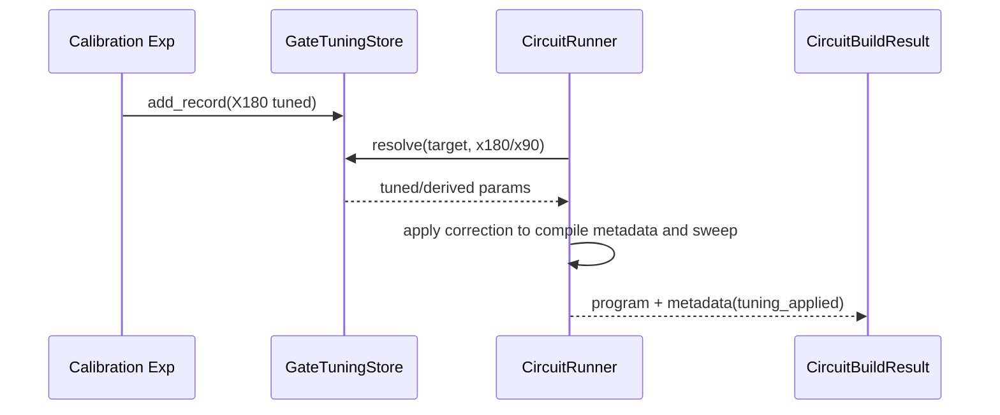

# Design: Gate Tune-Up Framework (Family-Based Derivation)

## Status
Implemented (MVP Phase 1) for X/Y family integration with CircuitRunner.

## Goals
- Standardize tuning artifacts (`GateTuningRecord`)
- Anchor tuning on base gates (e.g., `X180`)
- Derive related gates deterministically (e.g., `X90 = 0.5 * X180`)
- Apply corrections at compiler time
- Preserve simulator-only serialized QUA validation

## Core Data Model

```python
@dataclass(frozen=True)
class GateTuningRecord:
    family: str
    target: str
    base_operation: str
    amplitude_scale: float
    detune_hz: float
    phase_offset_rad: float
    derived_operations: dict[str, float]  # e.g. {"x90": 0.5, "xn90": -0.5}
```

`GateTuningStore.resolve(target, operation)` returns concrete per-operation tuning.

## Architecture

```mermaid
flowchart LR
  A[Tune-Up Experiment\n(PowerRabi/DRAG)] --> B[GateTuningRecord]
  B --> C[GateTuningStore]
  C --> D[CircuitRunner.compile]
  D --> E[Apply tuned params\n(amplitude/detune/phase)]
  E --> F[QUA program build]
  F --> G[Serialize QUA + provenance]
```

## Compiler Integration
1. Circuit receives stable gate identities.
2. Compiler resolves tuning using `(target, operation)`.
3. Tuning is written to circuit metadata (`tuning_applied`).
4. Supported correction in MVP: amplitude scale (applied to gain sweep in `power_rabi`).
5. Derived operations are computed from base record factors.

## Data Flow



## Pseudo-code

```python
record = make_xy_tuning_record(target=qb_el, amplitude_scale=0.92)
store.add_record(record)

runner = CircuitRunner(session)
session.gate_tuning_store = store

circuit, sweep = make_power_rabi_circuit(op="x90", gains=[1.0], ...)
build = runner.compile(circuit, sweep=sweep)
assert build.metadata["applied_gain_scale"] == 0.46
```

## Integration Boundaries
- **In scope (MVP)**
  - X-family record creation and derivation
  - CircuitRunner compile-time correction hooks
  - Metadata provenance (`record_id`, derived factor, applied scale)
- **Out of scope (Phase 1)**
  - Hardware execution/closed-loop online tune
  - Multi-parameter nonlinear optimizer in compiler
  - Automatic pulse-registry rewrite in strict mode

## Validation Contract
- Source of truth: serialized compiled QUA and compile metadata
- Environment: simulator/compile-only
- Artifacts: `docs/gate_tuning_serialization_validation.md`

## Phase Plan
### Phase 1
- X/Y family tuning records
- Base gate anchoring + derived `X90`
- Serialized QUA parity/documentation

### Phase 2
- Add displacement/sideband family derivations
- Add detuning and phase correction lowering beyond metadata
- Add patch-intent integration with orchestrator
