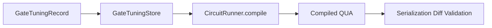
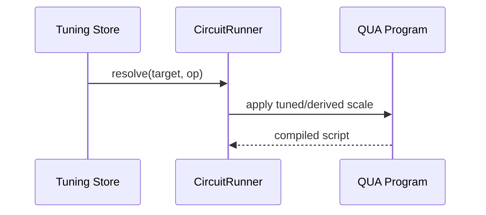

# Gate Tuning Serialization Validation

Validation mode: compiled QUA serialization only (simulator/compile path, no hardware execution).

## Architecture diagram



## Data flow diagram



## Example pseudo-code

```python
record = make_xy_tuning_record(target=qb_el, amplitude_scale=0.92)
store.add_record(record)
build = CircuitRunner(session).compile(circuit_x90)
assert build.metadata['applied_gain_scale'] == 0.46
```

## Integration boundaries

- Inputs: tuning records, circuit metadata, compiled pulse registry
- Outputs: serialized QUA scripts + metadata
- Excluded: hardware execution path

## Scope

- Tuned `X180`
- Derived `X90` (from `X180` via family derivation factor 0.5)
- Short circuit `X180 -> X90`

## GateTuningRecord

- Record ID: `a23a57d9cf78665c`
- Applied gain scale (`X180`): `0.92`
- Applied gain scale (`X90` derived): `0.46`

## Serialized comparison

### X180

- Result: **Behaviorally different**
- Note: Compiled scripts differ after normalization (expected when tuning modifies amplitudes).

### X90

- Result: **Behaviorally different**
- Note: Compiled scripts differ after normalization (expected when tuning modifies amplitudes).

### XY_PAIR

- Result: **Functionally equivalent with timing notes**
- Note: Only timestamp header differs.

## Serialized artifacts

- [x180 legacy](docs/circuit_tuning_serialized/x180_legacy.py)
- [x180 tuned](docs/circuit_tuning_serialized/x180_tuned.py)
- [x90 legacy](docs/circuit_tuning_serialized/x90_legacy.py)
- [x90 tuned](docs/circuit_tuning_serialized/x90_tuned.py)
- [xy pair legacy](docs/circuit_tuning_serialized/xy_pair_legacy.py)
- [xy pair tuned](docs/circuit_tuning_serialized/xy_pair_tuned.py)
