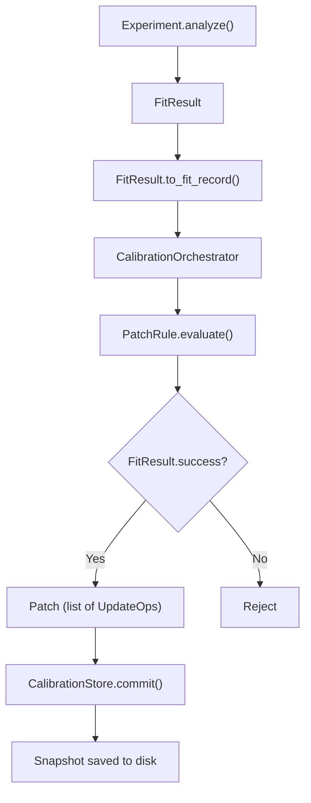

# Calibration System

The calibration subsystem manages the lifecycle of device parameters — from extraction
through validation to persistent storage.

## Architecture



## Key Components

| Component | Page | Purpose |
|-----------|------|---------|
| `CalibrationStore` | [Store](store.md) | JSON-backed, versioned parameter store |
| `CalibrationOrchestrator` | [Orchestrator](orchestrator.md) | Run → analyze → patch pipeline |
| Patch Rules | [Patch Rules](patch-rules.md) | 11 named rules for parameter extraction |
| Transitions | [Transitions](transitions.md) | Pulse name resolution, families |

## Quick Example

```python
from qubox.calibration import CalibrationOrchestrator, CalibrationStore

store = session.store

# Run experiment and extract calibration
orchestrator = CalibrationOrchestrator(store)
result = session.exp.qubit.power_rabi(a_min=0, a_max=0.5, da=0.005, n_avg=1000)

# Apply calibration (transactional)
orchestrator.apply(result, rule="pi_amp", reason="rabi_calibration")

# Store is updated and snapshot saved
print(store.get_pulse_calibration("x180").amp)  # Updated value
```

## Data Models

The calibration system uses 12+ Pydantic v2 models for type-safe data:

| Model | Purpose |
|-------|---------|
| `CQEDParams` | Core cQED parameters (qubit freq, anharmonicity, etc.) |
| `PulseCalibration` | Single pulse amplitude, duration, DRAG |
| `ReadoutCalibration` | Readout frequency, power, threshold, rotation |
| `MixerCalibration` | Mixer correction matrix |
| `CalibrationMetadata` | Timestamps, versions, provenance |
| `FitRecord` | Serializable fit result for storage |

## Principles

!!! info "Transactional Patches"
    A `Patch` is a list of `UpdateOp`s that either all succeed or are all rejected.
    Partial calibration updates are never applied.

!!! info "Artifacts Always Persist"
    Raw data and fit results are always saved, even when the calibration is rejected.
    You never lose data from a failed calibration.

!!! info "FitResult.success Gate"
    The `FitResult.success` flag is the single source of truth for whether a calibration
    should be applied. Patch rules check this before generating UpdateOps.
