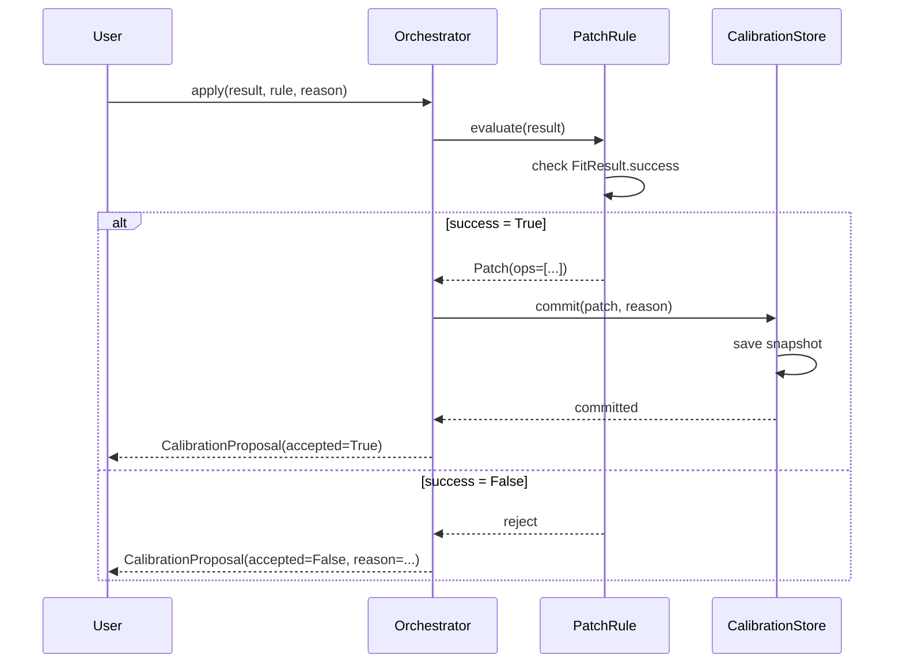

# CalibrationOrchestrator

Manages the run → analyze → patch calibration pipeline with transactional semantics.

## Overview

The orchestrator sits between experiment results and the `CalibrationStore`. It evaluates
patch rules, validates fit quality, and applies calibration updates atomically.

## Usage

```python
from qubox.calibration import CalibrationOrchestrator

orchestrator = CalibrationOrchestrator(session.store)

# Run experiment
result = session.exp.qubit.power_rabi(a_min=0, a_max=0.5, da=0.005, n_avg=1000)

# Apply calibration via named rule
orchestrator.apply(result, rule="pi_amp", reason="rabi_recalibration")
```

## API

| Method | Description |
|--------|-------------|
| `apply(result, rule, reason)` | Evaluate rule and commit if valid |
| `preview(result, rule)` | Show proposed changes without applying |
| `validate(result, rule)` | Check if result passes the rule's criteria |
| `batch_apply(results, rules)` | Apply multiple calibrations atomically |

## Workflow



## Preview Before Apply

Use `preview()` to see what would change without modifying the store:

```python
proposal = orchestrator.preview(result, rule="pi_amp")
for op in proposal.ops:
    print(f"{op.field}: {op.old_value} → {op.new_value}")
```

## Batch Calibration

Apply multiple calibrations transactionally:

```python
results = {
    "qubit_freq": spectroscopy_result,
    "pi_amp": rabi_result,
    "readout_freq": readout_result,
}

orchestrator.batch_apply(
    results,
    rules=["frequency", "pi_amp", "readout_freq"],
    reason="full_recalibration"
)
# All succeed together or none are applied
```

## Error Handling

| Scenario | Behavior |
|----------|----------|
| `FitResult.success = False` | Patch rejected, artifact still saved |
| Parameter out of physical bounds | Patch rejected with validation error |
| Store write failure | Transaction rolled back, no partial update |
| Rule not found | `KeyError` with available rule names |
