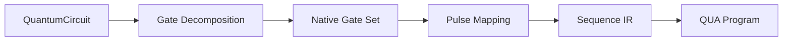

# Gates & Circuits

Gate-level abstraction for quantum circuit design and synthesis.

## QuantumCircuit

A gate-level view over the Sequence IR:

```python
from qubox import QuantumCircuit, QuantumGate

circuit = QuantumCircuit()
circuit.add(QuantumGate("X", target="transmon"))
circuit.add(QuantumGate("Rz", target="transmon", params={"angle": 3.14}))
circuit.add(QuantumGate("measure", target="resonator"))
```

### API

| Method | Description |
|--------|-------------|
| `add(gate)` | Append a gate to the circuit |
| `insert(index, gate)` | Insert gate at position |
| `to_sequence()` | Convert to Sequence IR |
| `depth` | Circuit depth |
| `gate_count` | Total number of gates |

## QuantumGate

| Field | Type | Description |
|-------|------|-------------|
| `name` | `str` | Gate name (`"X"`, `"Rz"`, `"CNOT"`, etc.) |
| `target` | `str` | Target element |
| `control` | `str \| None` | Control element (for 2-qubit gates) |
| `params` | `dict` | Gate parameters (angles, phases) |

## Gate Implementations (`qubox.gates`)

| Module | Content |
|--------|---------|
| `hardware/__init__.py` | Runtime hardware gate exports |
| `hardware/qubit_rotation.py` | `QubitRotationHardware` |
| `hardware/displacement.py` | `DisplacementHardware` |
| `hardware/sqr.py` | `SQRHardware` |
| `hardware/snap.py` | `SNAPHardware` |
| `hardware_base.py` | `GateHardware` ABC |

## Scope Boundary

`qubox` no longer ships the standalone `qubox.compile` gate-synthesis package
or the numerical cQED simulation stack. Those research-oriented workflows are
being split to `cqed_sim`. `qubox` still owns circuit construction,
ControlProgram realization, QUA compilation, and QM-hosted validation of the
compiled program.

The older gate-model, gate-sequence, fidelity, and noise helpers were removed
from `qubox.gates`; the active package now contains only the runtime hardware
gate implementations required by `qubox` itself.

## Circuit Compilation Pipeline


