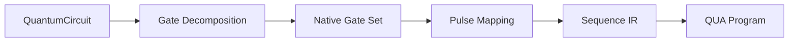

# Gates & Circuits

Gate-level abstraction for quantum circuit design and synthesis.

## QuantumCircuit

A gate-level view over the Sequence IR:

```python
from qubox import QuantumCircuit, QuantumGate

circuit = QuantumCircuit()
circuit.add(QuantumGate("X", target="transmon"))
circuit.add(QuantumGate("Rz", target="transmon", params={"angle": 3.14}))
circuit.add(QuantumGate("measure", target="resonator"))
```

### API

| Method | Description |
|--------|-------------|
| `add(gate)` | Append a gate to the circuit |
| `insert(index, gate)` | Insert gate at position |
| `to_sequence()` | Convert to Sequence IR |
| `depth` | Circuit depth |
| `gate_count` | Total number of gates |

## QuantumGate

| Field | Type | Description |
|-------|------|-------------|
| `name` | `str` | Gate name (`"X"`, `"Rz"`, `"CNOT"`, etc.) |
| `target` | `str` | Target element |
| `control` | `str \| None` | Control element (for 2-qubit gates) |
| `params` | `dict` | Gate parameters (angles, phases) |

## Gate Implementations (`qubox.gates`)

| Module | Content |
|--------|---------|
| `models.py` | `GateDefinition`, `GateSet` |
| `hardware.py` | Hardware-specific gate implementations |
| `fidelity.py` | Gate fidelity estimation, RB analysis |
| `decomposition.py` | Gate decomposition and synthesis |

## Gate Synthesis (`qubox.compile`)

Compile high-level gates into hardware-native pulse sequences:

```python
from qubox.compile import synthesize

# Decompose into native gate set
native_circuit = synthesize(circuit, gate_set="clifford")
```

| Module | Content |
|--------|---------|
| `synthesis.py` | Gate → pulse sequence compilation |
| `ansatz.py` | Variational ansatz optimization |
| `gpu_accel.py` | GPU-accelerated gate synthesis |

## Circuit Compilation Pipeline


