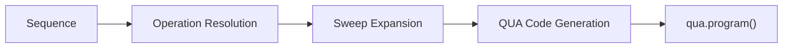

# Sequence IR

The `Sequence` intermediate representation provides a hardware-agnostic way to define
experiment operations. It decouples experiment logic from QUA syntax.

## Core Models

### Operation

A single action in a sequence:

```python
from qubox.sequence import Operation

op = Operation(
    name="x180",
    element="transmon",
    params={"amplitude": 0.312},
)
```

| Field | Type | Description |
|-------|------|-------------|
| `name` | `str` | Operation identifier (e.g., `"x180"`, `"readout"`) |
| `element` | `str` | Target hardware element |
| `params` | `dict[str, Any]` | Operation-specific parameters |
| `duration` | `int \| None` | Override duration in clock cycles |
| `condition` | `Condition \| None` | Conditional execution |

### Condition

Conditional branching within a sequence:

```python
from qubox.sequence import Condition

cond = Condition(
    variable="state",
    operator="==",
    value=1,
)
```

### Sequence

An ordered list of operations with optional sweep axes:

```python
from qubox.sequence import Sequence, Operation

seq = Sequence(
    operations=[
        Operation("x180", "transmon"),
        Operation("readout", "resonator"),
    ],
    sweeps=[...],          # Optional sweep axes
    acquisition=acq_spec,  # Optional acquisition config
)
```

## Sweep System

### SweepAxis

Defines one dimension of a parameter sweep:

```python
from qubox.sequence import SweepAxis
import numpy as np

freq_sweep = SweepAxis(
    parameter="frequency",
    element="transmon",
    values=np.linspace(4.5e9, 5.5e9, 201),
    label="Qubit Frequency",
    units="Hz",
)
```

| Field | Type | Description |
|-------|------|-------------|
| `parameter` | `str` | Parameter name to sweep |
| `element` | `str` | Target element |
| `values` | `np.ndarray` | Array of sweep points |
| `label` | `str` | Human-readable label for plots |
| `units` | `str` | Physical units |

### SweepPlan

Combines multiple `SweepAxis` objects for multi-dimensional sweeps:

```python
from qubox.sequence import SweepPlan

plan = SweepPlan(
    axes=[freq_sweep, amp_sweep],
    mode="nested",  # or "zip"
)
```

| Mode | Behavior |
|------|----------|
| `"nested"` | Outer product of all axes |
| `"zip"` | Parallel sweep (all axes same length) |

### AcquisitionSpec

Specifies how measurement data is collected:

```python
from qubox.sequence import AcquisitionSpec

acq = AcquisitionSpec(
    element="resonator",
    integration_weights="rotated_cosine",
    n_avg=1000,
    stream_mode="raw",
)
```

## Compilation

Sequences compile down to QUA programs via the `circuit_runner`:

```python
from qubox.programs import circuit_runner

qua_program = circuit_runner.compile(sequence, config)
```

The compilation pipeline:


