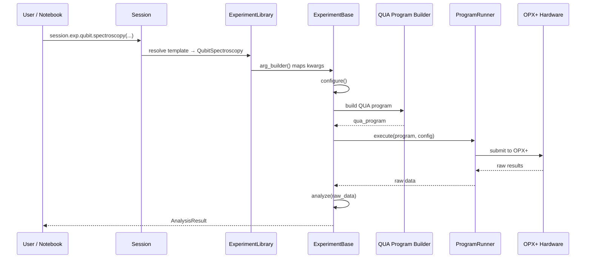
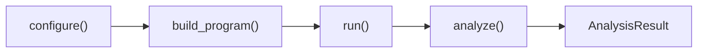
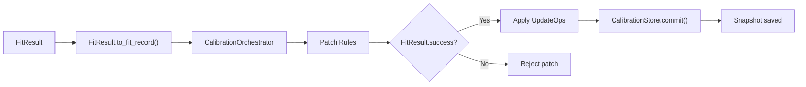

# Execution Flow

How an experiment goes from a user's Python call to pulses on quantum hardware.

## Overview



## Step-by-Step

### 1. Session Initialization

```python
session = Session.open(
    sample_id="sampleA",
    cooldown_id="cd_2026_03",
    registry_base="./samples",
    qop_ip="10.157.36.68",
    cluster_name="Cluster_2",
)
```

`Session.open(..., connect=True)` performs:

1. Resolves the sample/cooldown context and filesystem paths from the sample registry.
2. Loads `HardwareConfig` from `samples/<sample_id>/config/hardware.json`.
3. Requires a QOP host either from the explicit `qop_ip` argument or from persisted `hardware.json` extras.
4. Creates `QuantumMachinesManager`, `HardwareController`, `ProgramRunner`, and the session libraries.
5. Calls `SessionManager.open()`.
6. In simulation mode, skips `hardware.open_qm()`, keeps RF outputs off, and populates runtime elements from the generated config only.
7. In hardware mode, opens the `QuantumMachine`, loads measurement config, validates runtime elements, and logs the RF summary.

### 2. Template Resolution

```python
result = session.exp.qubit.spectroscopy(f_min=4.5e9, f_max=5.5e9, ...)
```

The `ExperimentLibrary` registry maps `qubit.spectroscopy` → `QubitSpectroscopy` class. An `arg_builder()` function translates user-friendly kwargs into the experiment's internal parameter format.

### 3. Experiment Lifecycle

Every experiment follows the `ExperimentBase` lifecycle:



- **`configure()`** — Validates parameters, resolves frequencies from `CalibrationStore`
- **`build_program()`** — Generates the QUA program via domain-specific builders
- **`run()`** — Submits to hardware, streams results
- **`analyze()`** — Fits data, produces `FitResult` and plots

### 4. QUA Program Building

QUA programs are built by domain-specific factories in `qubox.programs.builders/`:

```python
# Example: spectroscopy builder produces
with program() as prog:
    with for_(n, 0, n < n_avg, n + 1):
        with for_(*from_array(f, frequencies)):
            update_frequency("transmon", f)
            play("x180", "transmon")
            align()
            measure("readout", "resonator", ...)
            wait(thermalization_time)
```

### 5. Hardware Execution

The `ProgramRunner` handles:

1. Config compilation via `QuantumMachinesManager.open_qm(config)`
2. Program execution: `qm.execute(program)`
3. Result streaming via `job.result_handles`
4. Timeout management and error recovery

### 6. Analysis Pipeline

After hardware execution, the experiment's `analyze()` method:

1. Extracts raw I/Q data from result handles
2. Applies post-processing (demodulation, error correction)
3. Fits data using `qubox_tools.fitting.generalized_fit()`
4. Produces `FitResult` with extracted parameters
5. Generates plots via `qubox_tools.plotting`

## Calibration Flow

When an experiment extracts a calibrated parameter (e.g., qubit frequency):



The `CalibrationOrchestrator` enforces **transactional patch semantics**: all UpdateOps in a Patch either succeed together or are rejected entirely.

## Data Flow Summary

| Stage | Input | Output |
|-------|-------|--------|
| Template resolution | User kwargs | Experiment instance |
| Configuration | CalibrationStore params | Validated experiment config |
| Program build | Experiment config | QUA program |
| Execution | QUA program + HW config | Raw I/Q streams |
| Analysis | Raw data | FitResult + plots |
| Calibration | FitResult | Updated CalibrationStore |
