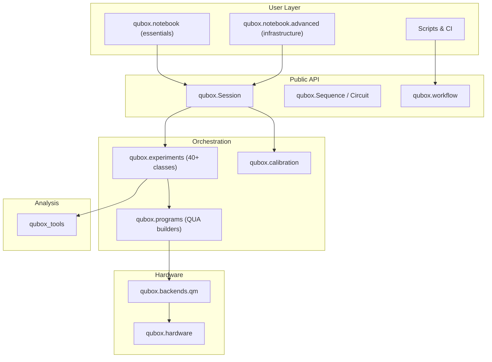

# Architecture

qubox is a layered cQED experiment framework designed around a few core principles:
**user simplicity**, **backend fidelity**, **inspectability**, and **reproducibility**.

## Repository Structure

```
qubox/              Main package — public API, experiments, calibration, hardware
qubox_tools/        Analysis toolkit — fitting, plotting, algorithms, optimization
qubox_lab_mcp/      Lab MCP server for research workflows
tools/              Developer & agent utilities
notebooks/          28 sequential experiment notebooks
tests/              Pytest test suite
docs/               Documentation & design reviews
```

## Layering



## In This Section

- [Package Map](package-map.md) — Every module and its role
- [Execution Flow](execution-flow.md) — How an experiment goes from definition to hardware
- [Design Principles](design-principles.md) — Core values and key design decisions
- [Refactor Status](refactor-status.md) — Current state of the architecture refactor
