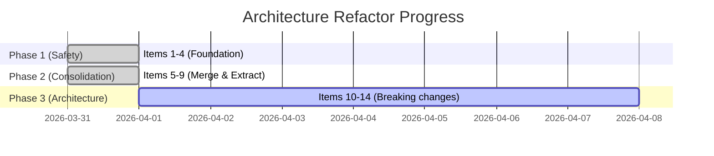

# Refactor Status

Tracking the ongoing architecture refactor from the [Architecture Audit](https://github.com/SoraUmika/qubox/blob/main/docs/architecture/ARCHITECTURE_AUDIT.md).

## Phase Overview



## Phase 1 — Safety :material-check-all:{ .green }

**Status: COMPLETE**

No behavioral changes — purely defensive hardening.

| # | Item | Status |
|---|------|--------|
| 1 | Create `DeviceMetadata` (replace `cQED_attributes`) | :material-check: Done |
| 2 | Update `SessionManager.context_snapshot()` → `DeviceMetadata` | :material-check: Done |
| 3 | Update `ExperimentRunner` → `DeviceMetadata` | :material-check: Done |
| 4 | Update `ExperimentBase.attr` → `DeviceMetadata` | :material-check: Done |
| — | `Session.__getattr__` deprecation warning added | :material-check: Done |
| — | `FitResult.to_fit_record()` / `FitRecord.from_fit_result()` bridge | :material-check: Done |
| — | Test updates (conftest, parameter resolution) | :material-check: Done |
| — | `DeviceMetadata` exported from `qubox.core` and `qubox` | :material-check: Done |

### DeviceMetadata

The `cQED_attributes` god-object dict has been replaced by `DeviceMetadata` — a frozen dataclass with a live `CalibrationStore` reference:

```python
from qubox.core import DeviceMetadata

# Properties delegate to CalibrationStore
meta.qubit_freq_hz        # → store.cqed_params.qubit_freq
meta.resonator_freq_hz    # → store.cqed_params.rr_freq
meta.pi_amp               # → store.get_pulse_calibration(...).amp
```

## Phase 2 — Consolidation :material-check-all:{ .green }

**Status: COMPLETE**

Backward-compatible changes with compatibility shims.

| # | Item | Status |
|---|------|--------|
| 5 | Move `PulseOp` → `qubox.core.pulse_op` | :material-check: Done |
| 6 | Merge `qubox.analysis` → `qubox_tools` (50+ imports) | :material-check: Done |
| 7 | Slim notebook surface (essentials + advanced tiers) | :material-check: Done |
| 8 | Create `qubox.workflow` package | :material-check: Done |
| 9 | Add simulator integration tests | :material-close: Not started |

### Import Migration Map

| Old Path | New Canonical Path |
|----------|-------------------|
| `qubox.analysis.analysis_tools` | `qubox_tools.algorithms.transforms` |
| `qubox.analysis.algorithms` | `qubox_tools.algorithms.core` |
| `qubox.analysis.cQED_models` | `qubox_tools.fitting.cqed` |
| `qubox.analysis.cQED_plottings` | `qubox_tools.plotting.cqed` |
| `qubox.analysis.output` | `qubox_tools.data.containers` |
| `qubox.analysis.metrics` | `qubox_tools.algorithms.metrics` |
| `qubox.analysis.fitting` | `qubox_tools.fitting.routines` |
| `qubox.analysis.calibration_algorithms` | `qubox_tools.fitting.calibration` |
| `qubox.analysis.post_process` | `qubox_tools.algorithms.post_process` |
| `qubox.analysis.post_selection` | `qubox_tools.algorithms.post_selection` |
| `qubox.analysis.pulseOp` | `qubox.core.pulse_op` |

### Notebook Surface Tiers

**`qubox.notebook`** (essentials — ~65 symbols):  
Experiments, session management, workflow, waveform generators, basic calibration tools.

**`qubox.notebook.advanced`** (infrastructure — ~45 symbols):  
CalibrationStore, data models, artifacts, schemas, verification, device registry.

## Phase 3 — Architecture :material-progress-wrench:

**Status: NOT STARTED**

Breaking changes requiring version bump and documented migration.

| # | Item | Status | Risk |
|---|------|--------|------|
| 10 | Eliminate adapter layer | :material-close: | High |
| 11 | Replace `SessionManager` with `qubox.engine` | :material-close: | High |
| 12 | Remove `Session.__getattr__` forwarding | :material-close: | High |
| 13 | `CalibrationState` with copy-on-write | :material-close: | Medium |
| 14 | Backend protocol formalization | :material-close: | Medium |

### Phase 3 Migration Path

```
Phase 3 changes will require:
├── Version bump (3.1.0 or 4.0.0)
├── Documented migration guide updates
├── All notebook updates
└── User communication before shipping
```
