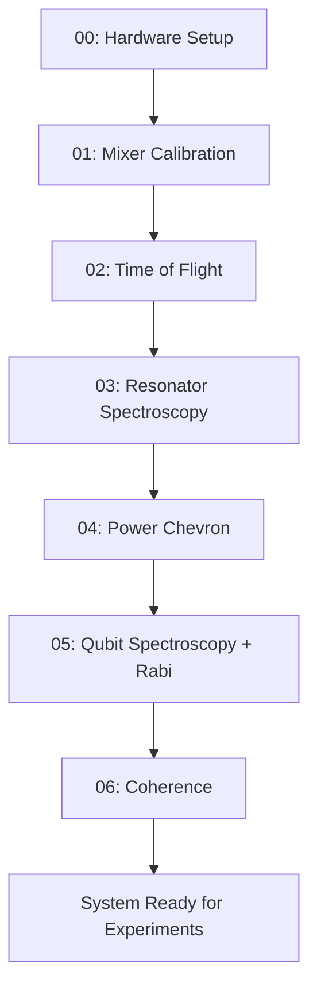

# Notebook Workflow

qubox uses sequential, numbered notebooks under `notebooks/` for calibration and
experiment workflows. Each cooldown starts from notebook `00` and progresses forward.

## Notebook Sequence

| # | Notebook | Purpose |
|---|----------|---------|
| 00 | `00_hardware_defintion.ipynb` | Hardware config, QM connection, Octave setup |
| 01 | `01_mixer_calibrations.ipynb` | IQ mixer offset and imbalance calibration |
| 02 | `02_time_of_flight.ipynb` | Time-of-flight and ADC offset calibration |
| 03 | `03_resonator_spectroscopy.ipynb` | Find resonator frequency |
| 04 | `04_resonator_power_chevron.ipynb` | Readout power optimization |
| 05 | `05_qubit_spectroscopy_pulse_calibration.ipynb` | Qubit frequency + Rabi calibration |
| 06 | `06_coherence_experiments.ipynb` | T1, T2 Ramsey, T2 Echo |
| 07 | `07_cw_diagnostics.ipynb` | Continuous-wave diagnostics |
| 08 | `08_pulse_waveform_definition.ipynb` | Custom pulse waveform design |
| 09 | `09_qutrit_spectroscopy_calibration.ipynb` | EF transition spectroscopy |
| 10 | `10_sideband_transitions.ipynb` | Sideband transition mapping |
| 11 | `11_coherence_2d_pump_sweeps.ipynb` | 2D pump frequency/power sweeps |
| 12 | `12_chevron_experiments.ipynb` | Chevron drive characterization |
| 13 | `13_dispersive_shift_measurement.ipynb` | Dispersive shift measurement |
| 14 | `14_gate_calibration_benchmarking.ipynb` | DRAG, RB, gate fidelity |
| 15 | `15_qubit_state_tomography.ipynb` | State tomography |
| 16 | `16_readout_calibration.ipynb` | IQ blob, readout optimization |
| 17 | `17_readout_bayesian_optimization.ipynb` | Bayesian readout tuning |
| 18 | `18_active_reset_benchmarking.ipynb` | Active reset protocols |
| 19 | `19_spa_optimization.ipynb` | SPA flux/pump optimization |
| 20 | `20_readout_leakage_benchmarking.ipynb` | Readout-induced leakage |
| 21 | `21_storage_cavity_characterization.ipynb` | Storage cavity spectroscopy |
| 22 | `22_fock_resolved_experiments.ipynb` | Fock-state-resolved spectroscopy |
| 23 | `23_quantum_state_preparation.ipynb` | State preparation and verification |
| 24 | `24_free_evolution_tomography.ipynb` | Free evolution monitoring |
| 25 | `25_context_aware_sqr_calibration.ipynb` | SQR gate calibration |
| 26 | `26_sequential_simulation.ipynb` | Sequential simulation verification |
| 27 | `27_cluster_state_evolution.ipynb` | Cluster state experiments |

## Workflow Rules

### Sequential Execution

Notebooks are designed to run in order. Each notebook assumes that all prior notebooks
have been executed successfully in the current session.

```
00 → 01 → 02 → 03 → ... → 27
```

### Session Continuity

Notebook `00_hardware_defintion.ipynb` establishes the shared session:

```python
# In notebook 00
from qubox.notebook import open_shared_session
session = open_shared_session(...)
```

Subsequent notebooks retrieve it:

```python
# In notebooks 01+
from qubox.notebook import require_shared_session
session = require_shared_session()
```

### New Experiments

When adding a new experiment type, create a new numbered notebook rather than
appending to an existing one. Use the next available number in the sequence.

## Typical Cooldown Workflow

A typical cooldown calibration workflow covers notebooks 00–06:



After the base calibration (00–06), you can branch to any experiment notebook:

- **Gate work:** 08 → 14 → 15
- **Readout optimization:** 16 → 17 → 18 → 20
- **Cavity experiments:** 21 → 22 → 23 → 24
- **SPA work:** 19

## Timeout Budgets

Each notebook cell type has a timeout budget (see AGENTS.md §15):

| Cell Type | Warn After | Hard Interrupt |
|-----------|-----------|----------------|
| Import / setup | 30s | 60s |
| Hardware connection | 30s | 90s |
| QUA compilation | 45s | 120s |
| Simulator execution | 60s | 180s |
| Measurement sweep | 2 min | 10 min |
| Data processing | 30s | 120s |
