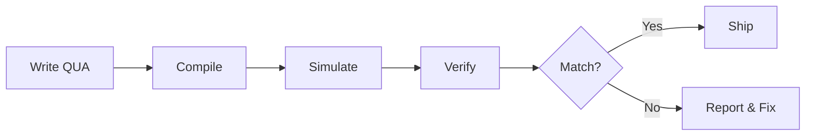

# QUA Validation

How to validate that compiled QUA programs match their intended behavior.

## The Fundamental Rule

!!! danger "Non-negotiable"
    **The compiled QUA program is the source of truth, not the written code.**

    Mismatches between intent and compiled behavior must always be reported explicitly.
    They are never silently accepted.

## Validation Pipeline



### Step 1: Compile

```python
from qm import QuantumMachinesManager

qmm = QuantumMachinesManager(host="10.157.36.68", cluster_name="Cluster_2")
qm = qmm.open_qm(config)

# Compilation must complete in < 1 minute
compiled = qm.compile(qua_program)
```

!!! warning
    If compilation exceeds 1 minute, report it. Do not proceed to hardware.

### Step 2: Simulate

```python
from qm import SimulationConfig

sim_config = SimulationConfig(duration=10000)  # clock cycles
job = qm.simulate(qua_program, sim_config)

# Get simulated analog outputs
samples = job.get_simulated_samples()
```

Use shortcuts to speed up simulation:

```python
# Quick structural check
result = session.exp.qubit.spectroscopy(
    f_min=4.8e9, f_max=4.9e9, df=1e6,  # Narrow range
    n_avg=1,                              # Single shot
)
```

### Step 3: Verify

Check the simulated output for:

| Check | What to Look For |
|-------|-----------------|
| Pulse ordering | Drive → align → measure → wait (correct order) |
| Timing | Pulses at expected clock cycles, no gaps |
| Control flow | Loops iterate `n_avg` times, sweeps cover full range |
| Measurements | Readout at correct sequence position |
| Frame updates | Phase/frequency updates applied before next pulse |
| Alignment | Multi-element alignment correct |

### Step 4: Report

If there's a mismatch:

1. Document what was expected vs. what was observed
2. Try to fix the code
3. If unfixable (hardware limitation): document in `limitations/qua_related_limitations.md`
4. Never silently proceed with a known mismatch

## Quick Validation Tool

```bash
# Quick structural check
python tools/validate_qua.py --experiment qubit_spectroscopy --quick

# Full validation
python tools/validate_qua.py --experiment power_rabi

# All experiments
python tools/validate_standard_experiments_simulation.py
```

## Common Pitfalls

| Issue | Cause | Fix |
|-------|-------|-----|
| Pulses out of order | Missing `align()` | Add `align()` between elements |
| Infinite compilation | Complex nested loops | Reduce loop depth, simplify |
| Missing measurement | `measure()` outside loop | Move inside averaging loop |
| Wrong frequency | `update_frequency()` placement | Update before `play()` |
| Phase errors | Missing `reset_frame()` | Reset frame between iterations |

## Hosted Server

| Parameter | Value |
|-----------|-------|
| Host | `10.157.36.68` |
| Cluster | `Cluster_2` |
| QM API Version | 1.2.6 |

!!! tip
    Always verify server reachability before connecting:
    ```python
    import subprocess
    result = subprocess.run(["ping", "-n", "1", "-w", "2000", "10.157.36.68"],
                           capture_output=True, text=True)
    reachable = result.returncode == 0
    ```
