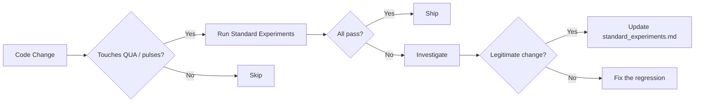

# Standard Experiments

Standard experiments are trust gates — reference protocols that validate the compilation
and execution pipeline. If a code change causes a standard experiment to fail, the change
must not ship without explanation.

## Purpose

Standard experiments verify that:

1. QUA programs compile correctly
2. Pulse ordering and timing are preserved
3. Control flow (loops, conditionals) works as expected
4. Measurements are placed correctly
5. The full pipeline (build → compile → simulate → verify) is intact

## Trust Gate Protocol



## Running Standard Experiments

### Quick Validation

```bash
python tools/validate_standard_experiments_simulation.py --quick
```

### Full Validation

```bash
python tools/validate_standard_experiments_simulation.py
```

### Single Experiment

```bash
python tools/validate_qua.py --experiment qubit_spectroscopy --quick
```

## Validation Requirements

Every QUA-touching change must pass this checklist:

- [ ] **Compile** — Program compiles in < 1 minute
- [ ] **Simulate** — Simulation completes on hosted server (`10.157.36.68`, `Cluster_2`)
- [ ] **Pulse ordering** — Correct sequence of drive → measure → wait
- [ ] **Control flow** — Loops iterate correctly, conditionals branch properly
- [ ] **Timing** — Alignment constraints satisfied, no unintended gaps
- [ ] **Measurements** — Readout placed at correct points in sequence

## Validation Shortcuts

For quick structural checks:

| Shortcut | Purpose |
|----------|---------|
| `n_avg = 1` | Skip averaging for structural verification |
| Shorten waits | Reduce thermal relaxation for simulation |
| Minimum duration | Simulate only essential pulse sequence |
| Narrow sweep | Reduce sweep points for faster execution |

## When Standard Experiments Fail

1. **Investigate** — Determine if the failure is a real regression
2. **If regression** — Fix the code; do not ship broken behavior
3. **If legitimate** — Update `standard_experiments.md`, explain why, get user approval
4. **Document** — Log any new limitations in `limitations/qua_related_limitations.md`

## Reference

The full standard experiment definitions are in [`standard_experiments.md`](https://github.com/SoraUmika/qubox/blob/main/standard_experiments.md) at the repository root.
