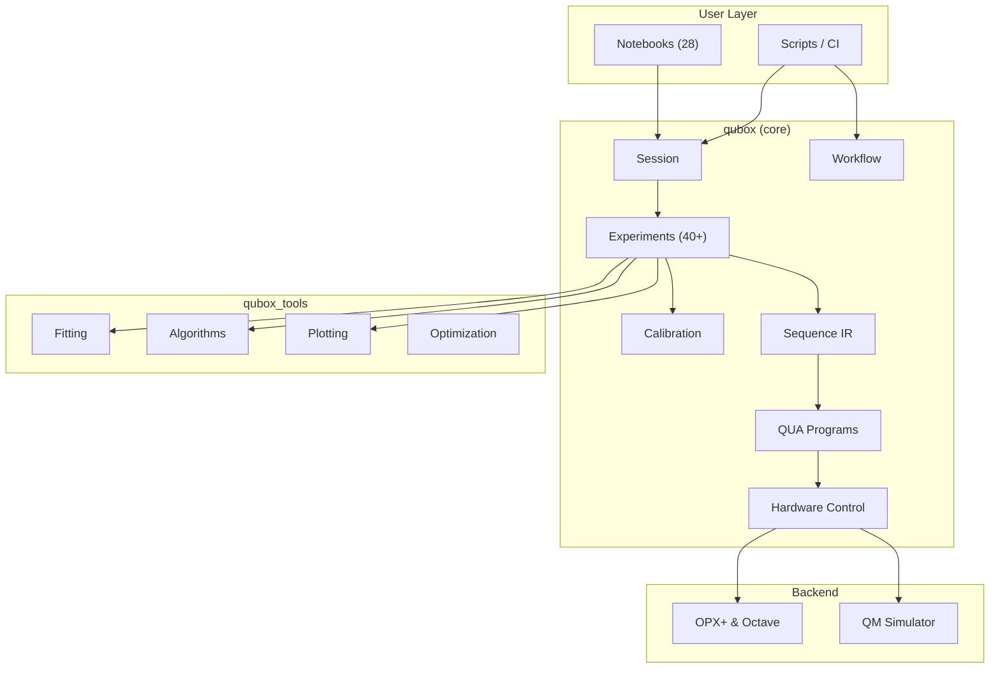

---
hide:
  - navigation
  - toc
---

<div class="hero" markdown>

# qubox

**A Python cQED Experiment Framework for Quantum Machines Hardware**
{ .subtitle }

[:material-rocket-launch: Quick Start](getting-started.md){ .md-button .md-button--primary }
[:material-book-open-variant: API Reference](api/index.md){ .md-button }
[:material-github: Source](https://github.com/SoraUmika/qubox){ .md-button }

</div>

---

## What is qubox?

**qubox** is a Python framework for circuit quantum electrodynamics (cQED) experiments targeting **Quantum Machines** hardware (OPX+ & Octave, QUA API v1.2.6). It compiles high-level experiment definitions into QUA programs and runs them on real quantum hardware or the QM simulator.

```python
from qubox import Session

session = Session.open(
    sample_id="sampleA",
    cooldown_id="cd_2026_03",
    registry_base="./samples",
    qop_ip="10.157.36.68",
    cluster_name="Cluster_2",
)

# Run an experiment from the template library
result = session.exp.qubit.spectroscopy(
    f_min=4.5e9, f_max=5.5e9, df=0.5e6, n_avg=1000
)
```

---

## Three Packages, One Lab

<div class="package-cards" markdown>

<div class="package-card" markdown>

#### :material-atom: qubox

The core framework — session management, 40+ experiment classes, calibration lifecycle, QUA compilation, and hardware execution.

```python
from qubox import Session, Sequence
from qubox.notebook import PowerRabi, CalibrationOrchestrator
```

</div>

<div class="package-card" markdown>

#### :material-chart-bell-curve: qubox_tools

Analysis toolkit — fitting, plotting, post-processing, and optimization utilities used by experiments and standalone scripts.

```python
import qubox_tools as qt
popt, _ = qt.generalized_fit(x, y, qt.fitting.models.lorentzian_model, p0=guess)
```

</div>

<div class="package-card" markdown>

#### :material-server: qubox_lab_mcp

An MCP server for code archaeology, notebook inspection, calibration diffing, and research workflow tooling.

```python
from qubox_lab_mcp import ServerConfig, load_server_config
```

</div>

</div>

---

## Key Features

<div class="feature-grid" markdown>

<div class="feature" markdown>

### :material-flask: 40+ Experiments

Spectroscopy, Rabi oscillations, T1/T2 coherence, gate calibration, readout optimization, cavity characterization, tomography, and more — all as composable classes.

</div>

<div class="feature" markdown>

### :material-tune: Calibration Lifecycle

Pydantic v2 data models, `CalibrationOrchestrator` with transactional patch rules, snapshot history, and JSON-backed versioned storage.

</div>

<div class="feature" markdown>

### :material-cog-play: QUA Compilation

High-level experiment definitions compile to QUA programs. Validated via compile → simulate → verify pipeline against the hosted server.

</div>

<div class="feature" markdown>

### :material-notebook: 28 Sequential Notebooks

Step-by-step experiment workflow from hardware definition through advanced quantum state preparation, each building on the previous.

</div>

<div class="feature" markdown>

### :material-gate-and: Gate Architecture

Gate models (Rabi, iSWAP, displacement, SNAP, SQR), hardware implementations, fidelity estimation, and GPU-accelerated synthesis.

</div>

<div class="feature" markdown>

### :material-chart-line: Portable Workflows

`qubox.workflow` provides stage checkpoints, fit quality gates, and calibration helpers usable from scripts and CI — no notebook kernel required.

</div>

</div>

---

## Architecture at a Glance



---

## Version

| Component | Version |
|-----------|---------|
| qubox | 3.0.0 |
| Python | 3.12.10 |
| QM / QUA API | 1.2.6 |
| Hardware | OPX+ + Octave |

---

<div style="text-align: center; margin-top: 2rem;" markdown>

[:material-book-open-variant: Full API Reference](api/index.md){ .md-button .md-button--primary }
[:material-cog: Architecture Deep Dive](architecture/index.md){ .md-button }
[:material-school: Notebook Guide](guides/notebooks.md){ .md-button }

</div>
