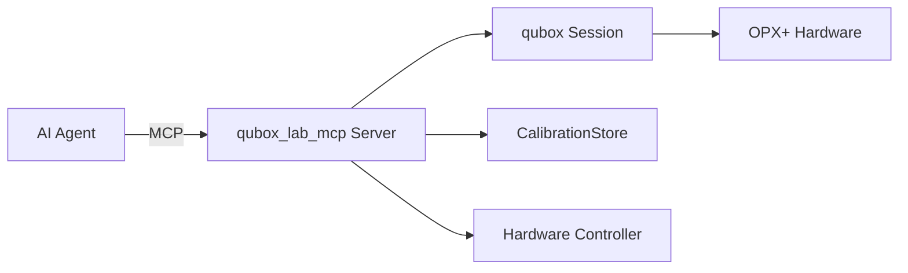

# Lab MCP Server

`qubox_lab_mcp` is a Model Context Protocol (MCP) server that exposes qubox lab capabilities
to AI agents.

## Overview

The Lab MCP server bridges qubox hardware and experiment functionality with AI assistants
using the [Model Context Protocol](https://modelcontextprotocol.io/).

## Architecture



## Components

| Component | File | Purpose |
|-----------|------|---------|
| Server | `server.py` | MCP server entry point and lifecycle |
| Config | `config.py` | `ServerConfig`, `load_server_config()` |
| Services | `services.py` | Orchestration layer between MCP and qubox |
| Resources | `resources/` | MCP resource handlers (read-only data access) |
| Tools | `tools/` | MCP tool implementations (actions) |
| Adapters | `adapters/` | Adapters for external systems |
| Models | `models/` | Data transfer objects |
| Policies | `policies/` | Access control and rate limiting |

## Configuration

```json
{
    "server_name": "qubox-lab",
    "host": "localhost",
    "port": 8080,
    "qubox_config": {
        "sample_id": "sampleA",
        "cooldown_id": "cd_2026_03",
        "registry_base": "./samples",
        "qop_ip": "10.157.36.68",
        "cluster_name": "Cluster_2"
    },
    "policies": {
        "max_concurrent_jobs": 1,
        "require_simulation_first": true
    }
}
```

## Available Resources

MCP resources provide read-only access to lab state:

| Resource | Description |
|----------|-------------|
| `calibration://current` | Current calibration parameters |
| `calibration://history` | Calibration history snapshots |
| `hardware://status` | Hardware connection status |
| `hardware://config` | Current hardware configuration |
| `experiments://catalog` | Available experiment types |

## Available Tools

MCP tools enable actions on the lab:

| Tool | Description |
|------|-------------|
| `run_experiment` | Execute an experiment by name with parameters |
| `get_calibration` | Read a specific calibration parameter |
| `simulate_experiment` | Run experiment on simulator only |
| `list_experiments` | List available experiment templates |

## Safety

- All experiment execution requires simulation first (configurable)
- Hardware-damaging parameter ranges are rejected
- Rate limiting prevents runaway automation
- Concurrent job limit prevents queue overflow

## Running the Server

```bash
python -m qubox_lab_mcp --config lab_config.json
```
