# qubox_tools

Analysis, fitting, plotting, and optimization toolkit for cQED experiments.

## Overview

`qubox_tools` is the standalone analysis package for qubox. It processes raw experiment
data without depending on the hardware stack.

```python
import qubox_tools
```

## Subpackages

| Package | Purpose | Page |
|---------|---------|------|
| `fitting` | Model fitting, cQED models, calibration bridge | [Fitting](fitting.md) |
| `algorithms` | Peak finding, post-processing, transforms | [Algorithms](algorithms.md) |
| `plotting` | 2D heatmaps, Bloch spheres, IQ scatter | [Plotting](plotting.md) |
| `optimization` | Bayesian, local, and stochastic optimization | [Optimization](optimization.md) |
| `data` | Smart result containers, persistence | (see below) |

## Data Containers

### Output

Smart result extraction with `.npz` save/load:

```python
from qubox_tools.data.containers import Output

output = Output(job=qm_job)

# Access raw I/Q data
I = output.get("I")
Q = output.get("Q")

# Save to disk
output.save("results/spectroscopy_001.npz")

# Load from disk
loaded = Output.load("results/spectroscopy_001.npz")
```

## Architecture

```mermaid
graph TD
    A["qubox_tools"] --> B["fitting/"]
    A --> C["algorithms/"]
    A --> D["plotting/"]
    A --> E["optimization/"]
    A --> F["data/"]

    B --> B1["routines.py — generalized_fit()"]
    B --> B2["models.py — 10+ model functions"]
    B --> B3["cqed.py — cQED-specific models"]
    B --> B4["calibration.py — store bridge"]

    C --> C1["core.py — peak finding"]
    C --> C2["post_process.py — demodulation"]
    C --> C3["transforms.py — IQ projection"]
    C --> C4["post_selection.py — 5 policies"]
    C --> C5["metrics.py — Wilson CI, scores"]

    D --> D1["common.py — 2D heatmap"]
    D --> D2["cqed.py — Bloch, IQ, chevron"]

    E --> E1["bayesian.py — GP optimization"]
    E --> E2["local.py — scipy minimize"]
    E --> E3["stochastic.py — DE, CMA-ES"]
```



## Import Migration

!!! note "Phase 2 Refactor"
    The former `qubox.analysis` package has been merged into `qubox_tools`.
    See the [Changelog](../changelog.md) for the full import mapping.

| Old Import | New Import |
|-----------|-----------|
| `from qubox.analysis.fitting import generalized_fit` | `from qubox_tools.fitting.routines import generalized_fit` |
| `from qubox.analysis.output import Output` | `from qubox_tools.data.containers import Output` |
| `from qubox.analysis.cQED_models import lorentzian` | `from qubox_tools.fitting.cqed import lorentzian` |
| `from qubox.analysis.cQED_plottings import plot_bloch` | `from qubox_tools.plotting.cqed import plot_bloch` |
